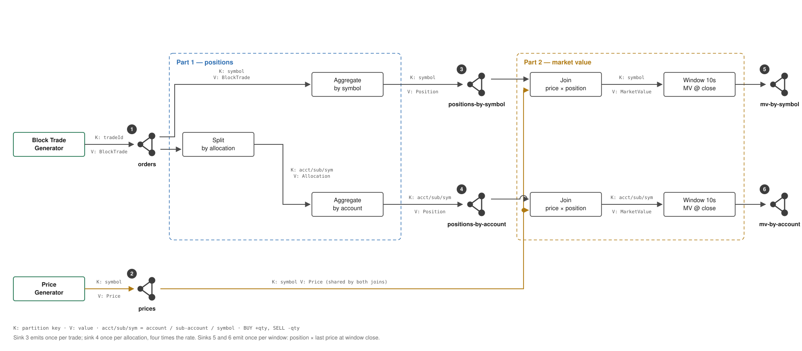

# flink-training

[](https://github.com/jimzucker/flink-training/actions/workflows/ci.yml)

Final project: calculate **positions** and **market value** from a stream of block
trades, using Apache Flink and Kafka.

Requirements come from [`assignment.pptx`](assignment.pptx).

---

## Problem statement

Process a stream of **block trades** and publish **positions** aggregated two ways
in parallel — by symbol, and by account/sub-account/symbol. Then join **prices**
to those positions and publish **market value** the same two ways, emitted once
per minute.

A block trade is one order split across several accounts: a trade of 400 shares
allocated to 4 accounts becomes 4 allocations of 100. That split is why the two
aggregations differ — one key per symbol, versus one key per account and symbol.

## Pipeline design



Numbered left to right, in the order the demo talks through them. Full walkthrough,
object model and design rationale: [`docs/design/pipeline-design.md`](docs/design/pipeline-design.md).

## Expected inputs and outputs

The numbers the demo is verified against — each output ties back to a numbered
element in the diagram.

| Parameter | Input |
|---|---|
| Trades | 10 / sec |
| Prices | 1000 / sec |
| Symbols | 4 unique |
| Accounts | 4 unique |
| Allocations per trade | 4 (one per account) |

| # | Sink | Rate | Unique keys |
|---|---|---|---|
| 3 | `positions-by-symbol` | 10 / sec — one per trade | **4** |
| 4 | `positions-by-account` | 40 / sec — one per allocation | **16** |
| 5 | `mv-by-symbol` | 4 / min — one per key per window | **4** |
| 6 | `mv-by-account` | 16 / min — one per key per window | **16** |

Verified against the real topics by `scripts/verify-topics.sh`. Sinks 3–6 are
produced by the jobs in later steps; what step 02 proves is the input side.

## Running it locally

Full one-command start arrives in step 08. Today the stack is Kafka, and the
generators run on the host.

```bash
docker compose -f docker/compose.yml up -d --build   # everything, idle
./scripts/start-generators.sh                        # start the data on cue
```

The first command is the whole stack: jars built inside Docker, Kafka and Flink
started, topics created, both jobs submitted. Nothing needs building or launching
by hand and no Java is required on the host — about half a minute from nothing to
a running pipeline.

The generators come up **idle**, so the dashboard is visibly empty until you start
them. Graphs going from flat to flowing while people watch is the most persuasive
moment in the demo, and a stack that is already busy when it appears gives it
away.

```bash
./scripts/demo.sh              # the same, and tells you what to open
./scripts/verify-cold-start.sh # tears it all down and checks it comes back green
```

### When the data starts

`GENERATOR_START` decides when the generators begin producing. Auto is
convenient, but it gives away the most persuasive moment in the demo — graphs
going from flat to flowing while people watch.

| Value | Behaviour |
|---|---|
| `manual` (default) | the container stays up and idle until you start it |
| `auto` | starts with the stack, so the dashboard is alive when you open it |
| a number | starts that many minutes after the stack comes up |

```bash
./scripts/start-generators.sh                                  # on cue

GENERATOR_START=2 docker compose -f docker/compose.yml up -d   # data arrives in 2 minutes
GENERATOR_START=auto docker compose -f docker/compose.yml up -d
```

Anything else fails at start rather than being guessed at.

To work on the code rather than run it, build on the host and verify:

```bash
source scripts/env.sh                                     # Java 17
mvn package -DskipTests
./scripts/verify-run.sh                                   # run and verify
```

`verify-run.sh` resets the topics, submits both jobs, emits an exact number of
records, waits for the sinks, and asserts the expected numbers across all six
topics — including that the two position aggregations reconcile, and that the
price each market-value window closed against matches the last price on the
price topic before that boundary. The Flink UI is at <http://localhost:8081>.

The generator runs exactly as it does for the demo: wall-clock event times, paced
in real time, at the demo rates. Nothing about the clock is simulated.

Only the **window** is shortened, and it is a runtime parameter rather than a
change to the calculation.

| | Window | Set by | Why |
|---|---|---|---|
| Specification, and the job default | **60s** | `WINDOW_MS` default | what the requirements state; this is what the design diagram shows |
| Live demo | **10s** | `docker/compose.yml` | a minute of dead air before the market value sinks say anything is a long time in front of an audience |
| Verification | **10s** | `scripts/verify-run.sh` | closing three one-minute windows would need three and a half minutes per run, and a check that slow stops being run |

Event time is the wall clock and pacing is real time in all three — only the
window length differs. The demo runbook says to volunteer that when reaching
sinks 5 and 6, since it is the one deviation from the specification visible on
screen.

How many windows close depends on where the run starts relative to a boundary,
which is a property of a real clock, so the count is read from the data rather
than predicted. Everything inside a window stays exact: a key never skips a
window once it starts, never stops early, and there is exactly one record per key
per window.

To skip the job and check the inputs only:

```bash
WITH_PIPELINE=0 ./scripts/verify-run.sh
```

The position sinks are written **exactly-once**, so anything reading them must
use `read_committed` — an uncommitted read shows records belonging to
transactions that may still abort. A record also becomes readable only when its
checkpoint commits, so the sinks advance once every five seconds rather than
continuously.

Parallelism is a runtime setting, because the demo raises it from 2 to 4 to show
throughput scaling with it:

```bash
PARALLELISM=4 docker compose -f docker/compose.yml --profile submit run --rm submit
```

To prove exactly-once actually holds, kill a task manager mid-run and check the
sinks are still exact:

```bash
./scripts/chaos-exactly-once.sh
```

Market value is emitted once per key per window — a minute as specified, ten
seconds in the demo and the verification — at the **price at close**. A
join advances at its slower input, so an input with no traffic would stall the
watermark and the windows would stop firing while every record that did arrive
was in order. `IDLENESS_MS` prevents that, and setting it to `0` disables it —
which is how the setting is shown to matter: with it off and any partition empty,
sinks 5 and 6 emit nothing at all while Part 1 is unaffected.

`verify-run.sh` resets the input topics, emits an exact number of records in
replay mode, and asserts the expected-output table against what landed. Every
check is exact — there are no tolerances, because the run is bounded by record
count rather than by elapsed time. Two invocations produce byte-identical topics.

To watch it run continuously instead:

```bash
java -jar generators/target/generators.jar     # wall clock, until stopped
```

Rates and seed come from the environment, which is how the scale cases turn each
knob independently:

| Variable | Default | What it does |
|---|---|---|
| `BOOTSTRAP_SERVERS` | `localhost:9092` | broker |
| `TRADES_PER_SECOND` | `10` | order rate — scale case 1 raises this to 1000 |
| `PRICES_PER_SECOND` | `1000` | price rate — scale case 2 raises this |
| `SEED` | `42` | fixes the content of the sequence |
| `START_EPOCH_MILLIS` | unset | unset uses the wall clock, so latency is measurable; setting it replays from a fixed origin with byte-identical output |
| `MAX_TRADES` | `0` | stop after N trades; `0` is unbounded |
| `MAX_PRICES` | `0` | stop after N prices; `0` is unbounded |
| `DURATION_SECONDS` | `0` | `0` runs until stopped |
| `COMPRESSION_TYPE` | `lz4` | producer codec. gzip caps one producer near 387,000 orders/sec against lz4's 879,000 |
| `GENERATOR_THREADS` | `1` | threads producing trades. Must divide the orders topic's partition count, so each partition has one writer |
| `BATCH_SIZE` | `262144` | 256KB against Kafka's 16KB default, worth +37% |
| `BUFFER_MEMORY` | `268435456` | so a stalled broker parks records instead of blocking |

### Offering more load than the pipeline can take

The generator, not Kafka, limits offered load: one thread serialising JSON
manages about 300,000 orders/sec where a bare producer reaches 750,000.
`GENERATOR_THREADS` divides the trade sequence across threads, one writer per
partition:

| 4 partitions, tuned broker | orders/sec |
|---|---|
| 1 thread, uncompressed | 348,289 |
| 4 threads, uncompressed | 337,638 |
| 1 thread, lz4 | ~879,000 |
| **4 threads, lz4** | **2,054,648** |

**Threads only pay with compression.** Uncompressed the run is pinned near
100MB/s however many threads produce it, because they share one `KafkaProducer`
and its single sender thread does the network I/O. With lz4 each thread
compresses on its own calling thread, so the work actually divides -- six times
the throughput, and ten times what the pipeline can consume.

Replay stays byte-identical, and not only run to run: the same seed produces the
same bytes at any thread count, because a trade's content is a function of its
sequence number rather than of how many draws preceded it, and trade *n* goes to
partition *n mod partitions* whoever writes it. A thread count that does not
divide the partitions is rejected rather than quietly producing a topic that
cannot be reproduced.

## What the demo is set to

Every default the stack runs with, in one place. All of them are environment
overrides on `docker compose`, so a demo can change one without touching a file.

| Setting | Default | Why this value |
|---|---|---|
| brokers | **1** | three were tried and halved throughput on one machine; `docker/compose.cluster.yml` repeats that measurement |
| `PARTITIONS` | `4` | one per symbol key, and the assignment's shape. `scripts/scale-units.sh` raises it to 8 for its own runs so no unit count is short of source subtasks |
| `PARALLELISM` | `2` | the assignment's baseline; the scale case raises it to 4 |
| `TASK_SLOTS` | `8` | two jobs at parallelism 4 |
| `TASKMANAGER_CPUS` | `0` | no limit. `scripts/scale-units.sh` sets 1, 2, 4 and 8 — naming a number as the default breaks on any machine with fewer cores |
| `WINDOW_MS` | `10000` locally, `60000` in the job | 10s so a demo shows several windows closing; 60s is what the requirements state |
| `CHECKPOINT_INTERVAL_MS` | `1000` | the floor under visible latency: a record is not readable until its checkpoint commits |
| `IDLENESS_MS` | `5000` | how long a quiet partition may hold the watermark back |
| `TRADES_PER_SECOND` | `10` | demo rate; scale case 1 raises it to 1000 |
| `PRICES_PER_SECOND` | `1000` | demo rate; scale case 2 raises it to 20000 |
| `SINK_COMPRESSION` | `lz4` | the broker's write path is the pipeline's ceiling and the TaskManager has cores to spare, so this spends the one on the other |
| `SINK_LINGER_MS` | `10` | Kafka's default of 0 sends a batch as soon as one record is ready, giving the broker many small requests |
| `SINK_BATCH_SIZE` | `131072` | 128KB, against Kafka's 16KB default |
| `GENERATOR_START` | `manual` | so a demo starts the data itself rather than finding it already running |
| `KAFKA_IO_THREADS` | `16` | Kafka's default is 8. Kept for latency, not throughput: measured against the defaults it moved throughput 2.9% and p95 produce latency from 136ms to 14ms |
| `KAFKA_NETWORK_THREADS` | `8` | Kafka's default is 3 |
| `KAFKA_SOCKET_BUFFER` | `1048576` | 1MB, against a 100KB default that is smaller than one producer batch |
| `KAFKA_QUEUED_MAX_REQUESTS` | `1000` | depth of the queue between network threads and handlers |

The last three moved in step 10 and are worth a sentence at the front of a talk:
they took parallelism 4 from 153,846 to 173,913 orders/sec and its back-pressure
from 85% to 66%, and they turned the curve the right way up — before them,
parallelism 4 was *slower* than parallelism 2.

Event times are wall clock by default, which is what makes end-to-end latency —
the age of a record when it reaches a sink — measurable at all.

To demonstrate reproducibility, replay from a fixed origin and bound the run by
**record count** rather than by time. Two such runs produce byte-identical
topics; bounding by duration does not, because a run ends mid-cycle and lands on
100 or 101 records depending on where the clock falls.

```bash
START_EPOCH_MILLIS=1700000000000 MAX_TRADES=100 MAX_PRICES=400 \
  java -jar generators/target/generators.jar
```

## Watching it run

```bash
docker compose -f docker/compose.yml up -d --wait kafka jobmanager taskmanager prometheus grafana
```

| | |
|---|---|
| Dashboard | <http://localhost:3000/d/flink-training/block-trade-pipeline> |
| Flink UI | <http://localhost:8081> |
| Prometheus | <http://localhost:9090> |

Sources on the left, sinks on the right, numbered as on the pipeline diagram. The
key counts are the expected-output table made visible: sinks 3 and 5 hold 4 keys,
sinks 4 and 6 hold 16.

The dashboard is in four sections, in the order they get used. **The pipeline**
first, because it is the demo: the six numbered topics, sources on the left and
sinks on the right. **Latency**, then **Saturation**, then **Resources** — each
one the answer to "why" for the section above it.

Sections two through four are for diagnosis rather than demonstration:

| Panel | The question it answers |
|---|---|
| **Consumer lag** | is the job keeping up? A bounded, sawtooth lag is healthy; a line that climbs and never returns is saturation, and it is the only panel that shows it — throughput looks fine right up to the point it is not |
| **Busy by task** | which operator is the ceiling? One task near 100% while the rest sit low names the thing to fix |
| **Back-pressure by task** | what is queued behind it? The back-pressured tasks are the victims; the busy task they feed is the cause |

Read together they separate the ways a pipeline runs out of room. One task pinned
means that operator is the ceiling; every task busy and none standing out means
the cluster itself is. But a pinned task with *idle* cores means the constraint
is outside the job entirely — waiting on something downstream — and that is the
case parallelism cannot fix. Step 10 found the account chain at
99% busy against 57% for the next task this way — `split_by_allocation` fans each
order into four allocations, so that branch carries four times the record rate.

The **Resources** section is where that distinction gets settled:

| Panel | The question it answers |
|---|---|
| **CPU — cores in use** | derived from JVM CPU time, so it reads in cores rather than a share of an unstated whole. Read it *with* back-pressure: 3.85 of 8 cores alongside a pinned throughput looks like a CPU ceiling and is not one — threads blocked on Kafka acknowledgements are neither busy nor idle |
| **Heap** and **Garbage collection** | the quietest failure. A rising heap floor and GC in the hundreds of ms/sec produce latency and back-pressure with no operator looking busy |
| **Network — bytes moved** | read from Kafka, written back, and shuffled between subtasks — for when bytes rather than records are the constraint |
| **Network buffers** | back-pressure is not a policy, it is these filling. Output pool usage moves before latency does |
| **free task slots** | a submission with none free does not queue, it fails |

One blind spot, deliberately: Prometheus scrapes Flink only, so the broker's own
throughput is not charted — and in step 10 the broker turned out to be the
ceiling. One broker absorbs about 750,000 records/sec, and each order becomes
five records (one symbol-side, four account-side), so the pipeline tops out near
137,000 orders/sec no matter what parallelism is set to. Low CPU with high
back-pressure is the signature: **Flink parallelism scales the work inside the
job and cannot scale a broker outside it.**

Flink has no metric for distinct keys, so the jobs publish one. Keys are
partitioned across subtasks, which is what makes summing the gauge give the total
without double counting. It counts from when a subtask started, so a restart
resets it until every key has been seen again.

To capture the dashboard as an image — this is how the pictures for the deck are
made:

```bash
./scripts/capture-dashboard.sh
```

Grafana renders it itself rather than relying on a browser. That is not
fastidiousness: a browser extension on the presenting machine was enough to stop
panels drawing entirely, while the dashboard was perfectly correct.

## Verifying the numbers

Every figure in the expected-output table is asserted on each run, with no
tolerances anywhere:

```bash
./scripts/verify-run.sh
```

It recomputes both halves of every market value independently from the topics
that fed them — the closing price from the price topic and the closing quantity
from the position topic — so neither rests on the job agreeing with itself.

### Explaining any number

Any figure on the dashboard can be walked back to the block trade that caused it:

```bash
./scripts/trace-trade.sh T000000098
```

```
① orders                T000000098  BUY 400 AAPL, 4 allocations of 100
③ positions-by-symbol   AAPL            -2800
④ positions-by-account  ACC1..4/SUB1/AAPL  -700 each
                        the four accounts sum to -2800, which is what sink 3 reports  OK
⑤ mv-by-symbol          -2800 x 74.25 = -207900.00
⑥ mv-by-account         -700 x 74.25 =  -51975.00 each
                        the account market values sum to -207900.00, which is what sink 5 reports  OK
```

The requirements ask for the numbers to be explainable and for logging to be
changed until they are. Every record carries the trade that last moved it, which
is what makes the walk back possible.

Full walkthrough for presenting it: [`docs/demo-runbook.md`](docs/demo-runbook.md).

## Latency

Two numbers, and they are not the same.

**What the pipeline takes** — published by the operators, visible on the
dashboard: **p50 59ms, p99 110ms** from a trade being created to its position
being computed.

**What a consumer waits for** — measured from outside:

```bash
./scripts/measure-latency.sh
```

```
orders                 p50=8      p99=20     max=27      (ms)
positions-by-symbol    p50=518    p99=1020   max=1025    (ms)
positions-by-account   p50=515    p99=1014   max=1036    (ms)

mv-by-symbol           p50=684    p99=1709   max=1709    (ms)   from window close
mv-by-account          p50=689    p99=1684   max=1684    (ms)
```

The input path is single-digit milliseconds. The positions are not, and the
reason is not the pipeline: under exactly-once a record is not readable until the
checkpoint that produced it commits, so a consumer waits a roughly uniform
interval on top of the processing time.

The checkpoint interval is that floor, and it behaves exactly like one:

| Checkpoint interval | p50 | max |
|---|---|---|
| 5s | 2488 ms | 4988 ms |
| 1s (default) | **518 ms** | **1025 ms** |

A checkpoint itself takes about 13ms, so what costs is the interval between them,
not the checkpoint. Both are charted, next to the latency they explain.

This is a trade, not a defect. A position is a running sum, so a record replayed
after a failure is a wrong number rather than a duplicate — exactly-once prevents
that, and the wait is its price.

Market value is measured from the **window close**, since the window is the
specification rather than a delay. Its figures step rather than spread — p95, p99
and the maximum are the same number, because every key in a window is emitted at
the same boundary and so shares an age.

## Scaling

**Flink converts cores into throughput almost perfectly until something else
becomes the constraint.** On a laptop that something is one Kafka broker, and the
curve flattens at 8 units. On AWS, with the broker out of the way, the same job
keeps scaling. Same code, same script, one variable changed.

### The two cases the requirements specify

Both pass.

| | orders/s asked | prices/s | orders through | allocations | order latency p50 |
|---|---|---|---|---|---|
| baseline | 10 | 1000 | 8/s | 33/s | 519 ms |
| **case 1** | 1000 | 1000 | **816/s** | **3269/s** | **522 ms** |
| **case 2** | 10 | **20000** | 8/s | 33/s | **513 ms** |

**Case 1** raised throughput a hundredfold and order latency did not move. The
requirement allows latency to rise; it did not need to.

**Case 2** raised the price rate twentyfold and order latency was unchanged. That
settles the question left open when prices were made a broadcast: the concern was
that every price would pass through the threads doing order work, and at twenty
times the rate it does not.

```bash
./scripts/scale-test.sh
```

### What a unit of parallelism buys

One unit is one core and one degree of parallelism, bought together — a KPU in
Managed Service for Apache Flink. One laptop, one broker, eight partitions
throughout, backlog drained with the producer stopped, so nothing varies but the
units:

| units | orders/sec | vs previous | Flink cores | broker cores | back-pressure |
|---|---|---|---|---|---|
| 1 | 30,505 | — | 1.00 | 0.10 | 24.1% |
| 2 | 65,721 | **2.15×** | 2.00 | 0.25 | 28.5% |
| 4 | 129,056 | **1.96×** | 3.94 | 0.39 | 51.6% |
| 8 | 151,969 | **1.18×** | 4.98 | 0.48 | 72.7% |

```bash
scripts/scale-units.sh
```

**It doubles, doubles again, then stops.** Up to four units Flink uses every core
it is given and parallelism converts straight into throughput. At eight it
reaches only 4.98 of 8 while back-pressure hits 72.7% — the subtasks are waiting,
not computing.

**And the broker is at 0.48 cores while being the thing in the way.** It has run
out of write throughput, not CPU: 151,969 orders/sec is 759,845 records/sec
against the ~750,000 one broker accepts, because each order becomes five records
— four account-side allocations plus one symbol-side position. A broker that
looks asleep can still be the ceiling, and only the two CPU columns beside the
throughput tell you which it is.

**Is that Flink's ceiling or the laptop's?** The laptop's. The same script
against a two-broker MSK cluster returns **1.73×** for that last doubling instead
of 1.18×, with Flink using 7.99 of its 8 cores instead of 4.98. Nothing about the
job changed — only what was in its way. That run is a confirmation rather than a
second demo, and its caveats are recorded with it.

Full analysis: [`docs/steps/step-12/scaling-demo.md`](docs/steps/step-12/scaling-demo.md)

---

## Prerequisites

| Tool | Version | Notes |
|---|---|---|
| Java | **17** | Flink 1.20 does not run on newer JDKs |
| Maven | 3.8+ | |
| Docker | with Compose v2 | for Kafka, Flink, Prometheus, Grafana |

This machine's default JDK is newer than Flink supports, so the build pins Java 17:

```bash
source scripts/env.sh    # exports JAVA_HOME for Java 17
mvn validate
```

The build fails fast with a clear message if the JDK is wrong, rather than
surfacing as a stack trace deep inside Flink.

## Versions

| Component | Version | Why |
|---|---|---|
| Flink | 1.20.4 | Last 1.x LTS, and the newest line AWS Managed Service for Apache Flink runs (step 9) |
| Flink Kafka connector | 3.4.0-1.20 | Matching connector release for Flink 1.20 |
| Java | 17 | Required by Flink 1.20 |
| Docker image | `flink:1.20.4-java17` | Pinned to the same patch as the jars |

Flink 1.20.5 exists as a Docker image but is not yet published to Maven Central,
so both are held at 1.20.4 to keep the cluster and the job jars identical.

## Continuous integration

Every push runs four jobs:

| Job | What it proves |
|---|---|
| **Build and test** | compiles on Java 17 and runs all 23 tests, including the Testcontainers integration test that starts its own broker |
| **Verify the expected numbers** | brings up Kafka, runs the generators bounded by record count, and asserts the expected-output table exactly |
| **Cold start** | brings the whole stack up from nothing and checks it came up green, so `docker compose up` on a clean machine is a tested path |
| **Shell scripts** | ShellCheck over the verification scripts, since they are part of how correctness is demonstrated |

The second job is the one that matters: it is the same `verify-run.sh` used
locally, so a change that quietly breaks the numbers fails the build rather than
surfacing during a demo.

### Catching it before the push

Waiting for CI to find a three-second ShellCheck error wastes a round trip, so
the two jobs that need no Docker stack run locally first:

```bash
scripts/precheck.sh           # shellcheck + mvn verify, about 15 seconds
scripts/precheck.sh --quick   # shellcheck + compile, no tests
```

Wire it to the push so it is not something to remember:

```bash
git config core.hooksPath .githooks   # once per clone
```

`.githooks/pre-push` then runs it on every `git push`, and `--no-verify`
bypasses it when that is deliberate. The two stack jobs still run on CI only;
they need several minutes and a quiet machine.

`main` is protected and requires all three checks to pass, so work reaches it
through a pull request:

```bash
git switch -c step-NN-name
# ... work, commit ...
git push -u origin step-NN-name
gh pr create --fill
gh pr merge --squash          # once CI is green
```

Squash-merging keeps `main` linear with one commit per step, and the step branch
stays for inspection. Direct pushes to `main` are rejected — verified, not
assumed.

## Repository layout

```
.github/workflows/     CI
assignment.pptx        the requirements
pom.xml                parent POM -- versions, dependency and plugin management
common/                domain model and JSON encoding
generators/            block trade and price generators
jobs/                  Flink jobs
docker/                local stack: Kafka, Flink, Prometheus, Grafana
docker/grafana/        dashboard and provisioning
scripts/               helper scripts
docs/design/           pipeline diagram and design notes
docs/steps/            per-step evidence: logs, metrics, screenshots
docs/reviews/          review exchanges for each step
JOURNAL.md             what was built at each step, and how it was verified
```

## How this project is built

Delivered against the order the assignment lists its deliverables. Each step is
developed on its own branch, reviewed, then squash-merged to `main` so that
`main` carries exactly one commit per completed step. Step branches are kept
for inspection.

The local Docker stack is stood up early and grown one service at a time, so
every step runs against real Kafka and a real Flink cluster rather than against
scaffolding that is later replaced.

See [`JOURNAL.md`](JOURNAL.md) for the step-by-step record.
