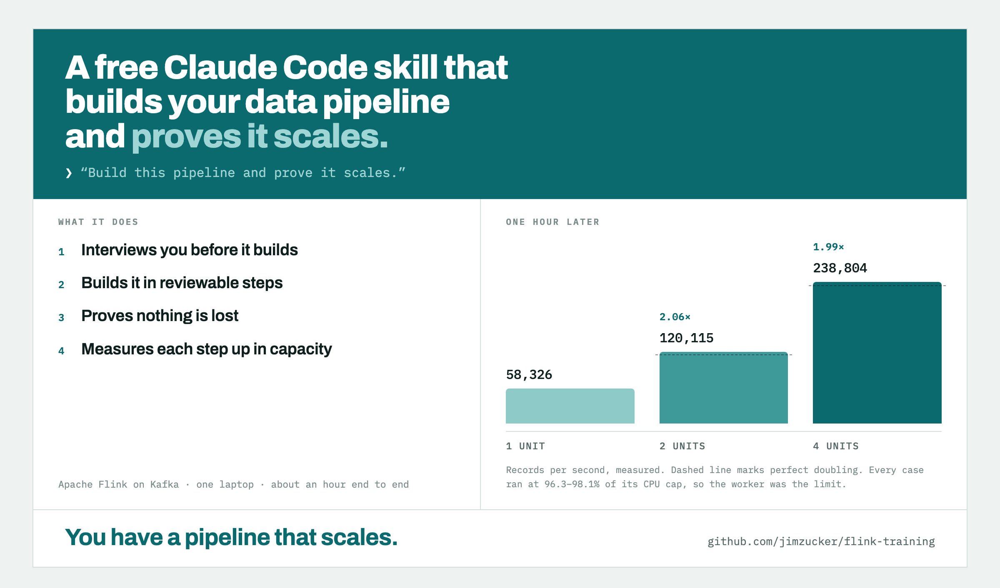

# scalable-flink-skill

A free Claude Code skill that builds your data pipeline and proves it scales.



Ask Claude to build a pipeline and prove it scales. About an hour later you
have the pipeline — and a scaling table, with the resource columns beside the
throughput, that holds up when someone pushes on it.

The skill itself lives in
[`.claude/skills/scalable-flink-skill/`](../../.claude/skills/scalable-flink-skill/)
and ships with the measurement harness that produces the table.

| | |
|---|---|
| the pitch, for a general audience | [`article.md`](article.md) |
| the card above, as HTML | [`card.html`](card.html) |
| the skill and its harness | [`.claude/skills/scalable-flink-skill/`](../../.claude/skills/scalable-flink-skill/) |

## What comes out

One measured suite from this repository's own pipeline, at 4,096 distinct keys:

| capacity | throughput | step |
|---|---:|---|
| 1 unit | 58,326 records/s | |
| 2 units | 120,115 records/s | **2.06×** [1.92, 2.18] |
| 4 units | 238,804 records/s | **1.99×** [1.95, 2.03] |

Every case ran at 96.3–98.1% of its CPU cap, so the worker was the constraint
and not something beside it. Garbage collection was 3.8 / 0.8 / 0.3% of
capacity. Source:
[`docs/skill-validation/demo-under-harness.md`](../skill-validation/demo-under-harness.md).

Make each message six times larger and the same pipeline still returns **4.57×**
across 1→4 cores — [`docs/skill-validation/payload-2k.md`](../skill-validation/payload-2k.md).

## What it does

1. **Interviews you before it builds.** One question at a time, each with a
   default: what goes in and what comes out, whether one input becomes several
   outputs, how many distinct keys, what has to be exactly right, who is
   watching, and — written down verbatim — the claim you want to make. Every
   later decision is judged against that sentence.
2. **Builds in reviewable steps.** One branch per step, each ending with the
   system running and measured rather than compiling.
3. **Proves nothing is lost, separately from proving it is fast.** A backlog
   small enough to drain to the last record, checked against a manifest
   computed from the input alone, with no tolerances — then again after killing
   a worker mid-drain. No throughput table is published for a build that has
   not passed.
4. **Measures each step up in capacity.** It caps one worker's CPU, raises
   parallelism to match, drains a fixed backlog, and leads with the step ratio
   you would actually buy.

## What you need

Docker, Python 3 (the harness is standard library only), and JDK 17. The stack
runs `flink:1.20.1-scala_2.12-java17` and `apache/kafka:3.9.0` on one machine.

```bash
git clone https://github.com/jimzucker/flink-training
cp -r flink-training/.claude/skills/scalable-flink-skill ~/.claude/skills/
```

Then ask Claude to build your pipeline and prove it scales. The skill starts
the interview.

## What you supply

Claude builds these with you; the harness expects them.

| piece | contract |
|---|---|
| a job jar | the Flink job, taking bootstrap, topics, parallelism and checkpoint interval as arguments |
| a generator | deterministic — two fills with one seed are byte-identical — writing a manifest of expected totals per key |
| a verifier | drains the outputs and exits non-zero on any loss |
| `pipeline.json` | describes the three, plus cases, passes, backlog and caps; start from `harness/pipeline.example.json` |

The full contract is
[`harness/README.md`](../../.claude/skills/scalable-flink-skill/harness/README.md).

## Running it

```bash
H=~/.claude/skills/scalable-flink-skill/harness/prove.py
nohup python3 $H all > results/all.log 2>&1 &
```

`all` is `up → preflight → completeness → tinyproof → fill → suite → report`,
stopping at the first step that does not pass. It writes `results/DONE` with
the verdict and the wall time. A full run takes about an hour on a laptop.

`--quick` takes about 48 minutes and stamps its table unpublishable — it tells
you the rig runs clean and roughly how fast, not what the ratio is.

## Limits

- **Flink on Kafka, today.** The interview and the measurement rules are
  general; the harness is not.
- **One machine.** The axis it measures is one worker growing, not workers
  multiplying across a network — a different measurement, with fixed costs paid
  again per worker.
- **About an hour per full run.** The completeness gate, the tiny proof and the
  fill do not shrink with `--quick`.

## The evidence

The skill was validated by running it 29 times from a clean room — a fresh
directory, one prompt, no human help, and Claude not allowed to read the
repository that wrote the rules. Every rule a run broke became a guard with a
self-test, or was deleted. The harness now carries 38 such guards, and a run
breaks all of them on purpose to check each one fires.

Every run, and every measured pass, is public:

| what | where |
|---|---|
| the runs and what each one showed | [`docs/skill-validation/`](../skill-validation/) |
| every measured pass in one file | [`docs/runs/ledger.csv`](../runs/ledger.csv) |

**The skill was named `prove-it-scales` until 2026-09-19.** The validation
records, run reports and ledger rows still carry that name, because that is the
name they were written under.
