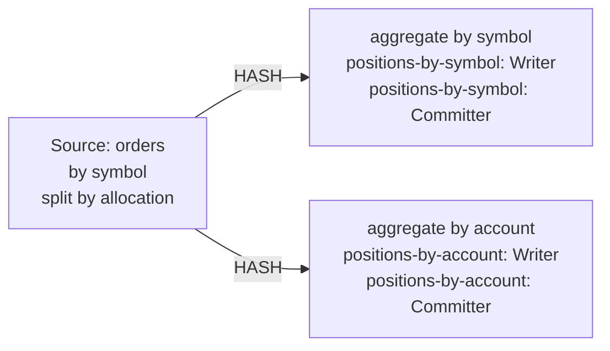

| field | value |
|---|---|
| axis | one worker growing: one task manager container capped at N cores, parallelism N, N slots |
| API level | Flink DataStream API, this repository's own PositionsJob (no SQL, no Table API) |
| guarantee | state: exactly-once checkpointing; sink: at-least-once, idempotent by emitting the absolute position per key |
| checkpoint interval | 5000 ms |
| build hash | `d465a077bb70b189` (completeness passed for `d465a077bb70b189`) |
| passes per case | 3 |
| study | scaling: every case configured identically |
| workload | 150,000,000 records, symbolCount 4,096, accountCount 4, allocationsPerTrade 4, distinctSymbolKeys 4,096, distinctAccountKeys 16,384, symbolUpdates 150,000,000, accountUpdates 600,000,000, 5 outputs per input |
| rate source | committed broker offsets on `block-trades` |
| CPU source | cgroup `cpu.stat usage_usec` |
| suite span | 2026-09-24 16:55:26 -> 2026-09-24 17:38:24 EDT (43m)  dashboard: from=1790283326180&to=1790285904250 |

**1→2 cores: 2.01× (target 1.80×), range 1.95–2.13× across passes.**
**2→4 cores: 1.96× (target 1.80×), range 1.88–2.03× across passes.**

| cores | speed | scaling | pipeline CPU | pipeline memory | Kafka CPU | Kafka memory | blocked by | what to do |
|---:|---:|---:|---|---|---|---|---|---|
| | | what the step into it gave | cores it could use / how much it used | memory it could use / share of the time spent tidying memory up | cores Kafka could use / how much it used | memory Kafka could use / how many times it filled up | | |
| 1 | 59,061/s | — | 1 / 100% | 2048m / 3.9% | 2.5 / 3% | 4.25g, never full | Pipeline CPU | check it matches |
| 2 | 118,706/s | 2.01x | 2 / 100% | 3072m / 0.9% | 2.5 / 6% | 4.25g, full 2,863x | Pipeline CPU | add cores for more |
| 4 | 232,894/s | 1.96x | 4 / 99% | 5120m / 0.3% | 2.5 / 13% | 4.25g, never full | Pipeline CPU | add cores for more |

| cores | pass | records/s | tm cores | % of cap | throttled | broker cores | src idle | src BP | headroom | vantage |
|---:|---|---:|---:|---:|---:|---:|---:|---:|---:|---:|
| 1 | p1-asc | 56,299 | 0.99 | 99.5% | 100% | 0.09 / 2.5 | 0.0% | 43.5% | 2526 s | 0.19% |
| 2 | p1-asc | 117,954 | 1.99 | 99.6% | 100% | 0.19 / 2.5 | 0.0% | 38.4% | 1133 s | 0.33% |
| 4 | p1-asc | 233,757 | 3.87 | 96.8% | 100% | 0.33 / 2.5 | 0.0% | 42.3% | 500 s | 0.13% |
| 4 | p2-desc | 239,775 | 4.01 | 100.2% | 100% | 0.33 / 2.5 | 0.0% | 41.5% | 447 s | 0.24% |
| 2 | p2-desc | 118,055 | 1.91 | 95.5% | 100% | 0.17 / 2.5 | 0.0% | 40.0% | 1130 s | 0.21% |
| 1 | p2-desc | 59,341 | 1.00 | 99.9% | 100% | 0.09 / 2.5 | 0.0% | 42.3% | 2389 s | 0.22% |
| 1 | p3-asc | 60,581 | 0.96 | 95.6% | 100% | 0.08 / 2.5 | 0.0% | 41.1% | 2342 s | 0.42% |
| 2 | p3-asc | 120,109 | 1.99 | 99.6% | 100% | 0.16 / 2.5 | 0.0% | 38.8% | 1110 s | 0.29% |
| 4 | p3-asc | 225,151 | 3.98 | 99.4% | 100% | 0.34 / 2.5 | 0.0% | 42.3% | 516 s | 0.39% |
| 1 | sentinel | 60,024 | 1.00 | 99.8% | 100% | 0.08 / 2.5 | 0.0% | 38.6% | 2362 s | 0.26% |

| cores | passes | mean records/s | spread | reportable |
|---:|---:|---:|---:|---|
| 1 | 4 | 59,061 | 7.2% | yes |
| 2 | 3 | 118,706 | 1.8% | yes |
| 4 | 3 | 232,894 | 6.3% | yes |

Sentinel: the 1-core case first (56,299 rec/s) and last (60,024 rec/s), drift +6.4% across the suite; counted in that case's spread.

### The job graph that ran

Read off the running plan, not drawn. Every case ran this shape — a row whose shape differed would have been thrown out.

