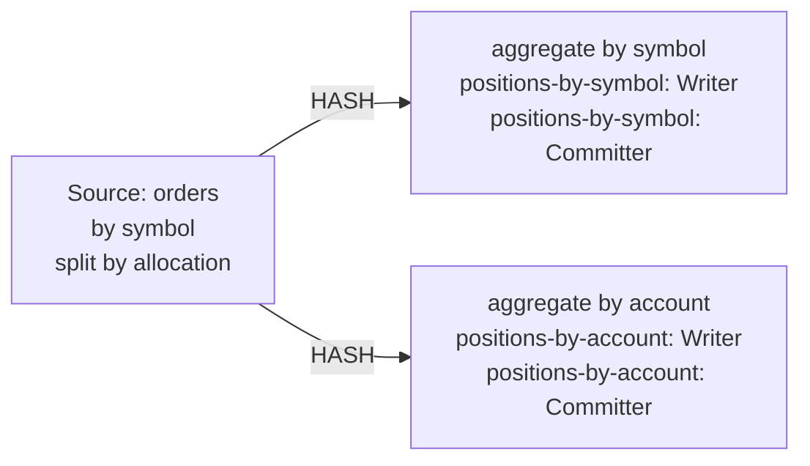

| field | value |
|---|---|
| axis | one worker growing: one task manager container capped at N cores, parallelism N, N slots |
| API level | Flink DataStream API, this repository's own PositionsJob (no SQL, no Table API) |
| guarantee | state: exactly-once checkpointing; sink: at-least-once, idempotent by emitting the absolute position per key |
| checkpoint interval | 5000 ms |
| build hash | `d465a077bb70b189` (completeness passed for `d465a077bb70b189`) |
| passes per case | 3 |
| study | scaling: every case configured identically |
| workload | 150,000,000 records, symbolCount 4,096, accountCount 4, allocationsPerTrade 4, distinctSymbolKeys 4,096, distinctAccountKeys 16,384, symbolUpdates 150,000,000, accountUpdates 600,000,000, 5 outputs per input |
| rate source | committed broker offsets on `block-trades` |
| CPU source | cgroup `cpu.stat usage_usec` |
| suite span | 2026-09-24 17:39:07 -> 2026-09-24 18:21:44 EDT (43m)  dashboard: from=1790285947998&to=1790288504928 |

**1→2 cores: 1.91× (target 1.80×), range 1.77–2.12× across passes.**
**2→4 cores: 1.99× (target 1.80×), range 1.90–2.14× across passes.**

| cores | speed | scaling | pipeline CPU | pipeline memory | Kafka CPU | Kafka memory | blocked by | what to do |
|---:|---:|---:|---|---|---|---|---|---|
| | | what the step into it gave | cores it could use / how much it used | memory it could use / share of the time spent tidying memory up | cores Kafka could use / how much it used | memory Kafka could use / how many times it filled up | | |
| 1 | 60,849/s | — | 1 / 98% | 2048m / 2.2% | 2.5 / 3% | 4.25g, never full | Pipeline CPU | check it matches |
| 2 | 116,373/s | 1.91x | 2 / 95% | 3072m / 0.8% | 2.5 / 6% | 4.25g, full 2,572x | Pipeline CPU | add cores for more |
| 4 | 231,595/s | 1.99x | 4 / 95% | 5120m / 0.3% | 2.5 / 12% | 4.25g, never full | Pipeline CPU | add cores for more |

| cores | pass | records/s | tm cores | % of cap | throttled | broker cores | src idle | src BP | headroom | vantage |
|---:|---|---:|---:|---:|---:|---:|---:|---:|---:|---:|
| 1 | p1-asc | 56,560 | 1.00 | 99.8% | 100% | 0.10 / 2.5 | 0.0% | 43.1% | 2508 s | 0.27% |
| 2 | p1-asc | 111,562 | 1.99 | 99.3% | 100% | 0.18 / 2.5 | 0.0% | 38.4% | 1207 s | 0.15% |
| 4 | p1-asc | 227,207 | 3.97 | 99.2% | 100% | 0.34 / 2.5 | 0.0% | 42.4% | 515 s | 0.09% |
| 4 | p2-desc | 229,294 | 3.93 | 98.2% | 100% | 0.33 / 2.5 | 0.0% | 45.0% | 509 s | 0.18% |
| 2 | p2-desc | 119,679 | 1.97 | 98.3% | 100% | 0.17 / 2.5 | 0.0% | 36.7% | 1115 s | 0.20% |
| 1 | p2-desc | 62,763 | 0.95 | 95.1% | 100% | 0.08 / 2.5 | 0.0% | 36.2% | 2260 s | 0.18% |
| 1 | p3-asc | 63,012 | 0.99 | 99.3% | 100% | 0.09 / 2.5 | 0.0% | 37.9% | 2245 s | 0.15% |
| 2 | p3-asc | 117,878 | 1.90 | 95.1% | 100% | 0.16 / 2.5 | 0.0% | 38.6% | 1135 s | 0.14% |
| 4 | p3-asc | 238,285 | 3.81 | 95.2% | 100% | 0.31 / 2.5 | 0.0% | 41.2% | 488 s | 0.10% |
| 1 | sentinel | 61,060 | 0.98 | 98.0% | 100% | 0.08 / 2.5 | 0.0% | 41.4% | 2320 s | 0.25% |

| cores | passes | mean records/s | spread | reportable |
|---:|---:|---:|---:|---|
| 1 | 4 | 60,849 | 10.6% | yes |
| 2 | 3 | 116,373 | 7.0% | yes |
| 4 | 3 | 231,595 | 4.8% | yes |

Sentinel: the 1-core case first (56,560 rec/s) and last (61,060 rec/s), drift +7.6% across the suite; counted in that case's spread.

### The job graph that ran

Read off the running plan, not drawn. Every case ran this shape — a row whose shape differed would have been thrown out.

