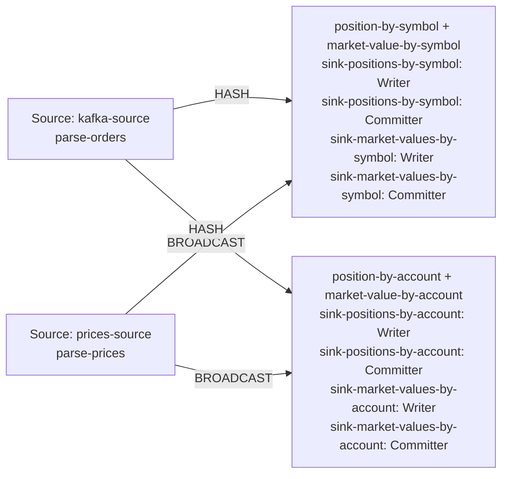

| field | value |
|---|---|
| axis | one machine, more cores: one task manager container capped at N cores, parallelism N, N slots |
| API level | Flink DataStream API (question 5 default), hand-written keyed broadcast operators, no SQL or Table API |
| guarantee | state: exactly-once checkpointing every 10 s; sink: at-least-once Kafka sink, idempotent by emitting the absolute position per key; duplicates dropped by per-symbol sequence |
| checkpoint interval | 10000 ms |
| build hash | `12d4d5de99ecf590` (completeness passed for `12d4d5de99ecf590`) |
| passes per case | 3 |
| study | scaling: every case configured identically |
| workload | 250,000,000 records, accountKeys 16,384, duplicateRecords 1,247,403, partitions 8, priceRecords 16,384, symbolKeys 4,096, uniqueOrders 248,752,597, 5 outputs per input |
| rate source | committed broker offsets on `orders` |
| CPU source | cgroup `cpu.stat usage_usec` |
| suite span | 2026-09-24 18:26:07 -> 2026-09-24 19:06:31 EDT (40m)  dashboard: from=1790288767780&to=1790291191073 |

**1→2 cores: 1.96× (target 1.80×), range 1.85–2.09× across passes.**
**2→4 cores: 1.90× (target 1.80×), range 1.79–2.02× across passes.**

| cores | speed | scaling | pipeline CPU | pipeline memory | Kafka CPU | Kafka memory | blocked by | what to do |
|---:|---:|---:|---|---|---|---|---|---|
| | | what the step into it gave | cores it could use / how much it used | memory it could use / share of the time spent tidying memory up | cores Kafka could use / how much it used | memory Kafka could use / how many times it filled up | | |
| 1 | 119,662/s | — | 1 / 100% | 1536m / 4.5% | 2.5 / 5% | 5g, full 1,694x | Pipeline CPU | check it matches |
| 2 | 234,966/s | 1.96x | 2 / 100% | 2048m / 1.6% | 2.5 / 9% | 5g, full 4,800x | Pipeline CPU | add cores for more |
| 4 | 446,297/s | 1.90x | 4 / 99% | 3072m / 0.8% | 2.5 / 21% | 5g, never full | Pipeline CPU | add cores for more |

| cores | pass | records/s | tm cores | % of cap | throttled | broker cores | src idle | src BP | headroom | vantage |
|---:|---|---:|---:|---:|---:|---:|---:|---:|---:|---:|
| 1 | p1-asc | 122,534 | 0.96 | 95.7% | 100% | 0.13 / 2.5 | 0.0% | 32.4% | 1907 s | 0.18% |
| 2 | p1-asc | 246,454 | 2.00 | 100.1% | 100% | 0.23 / 2.5 | 0.7% | 21.8% | 873 s | 0.24% |
| 4 | p1-asc | 456,430 | 3.99 | 99.7% | 100% | 0.52 / 2.5 | 1.8% | 13.1% | 372 s | 0.36% |
| 4 | p2-desc | 442,352 | 4.02 | 100.4% | 100% | 0.55 / 2.5 | 1.7% | 14.3% | 417 s | 0.06% |
| 2 | p2-desc | 226,252 | 2.01 | 100.3% | 100% | 0.26 / 2.5 | 1.0% | 22.5% | 947 s | 0.29% |
| 1 | p2-desc | 117,980 | 0.99 | 98.8% | 100% | 0.12 / 2.5 | 0.1% | 28.8% | 1974 s | 0.42% |
| 1 | p3-asc | 119,801 | 1.00 | 100.0% | 100% | 0.12 / 2.5 | 0.0% | 31.1% | 1950 s | 0.27% |
| 2 | p3-asc | 232,191 | 2.01 | 100.4% | 100% | 0.23 / 2.5 | 0.4% | 24.0% | 928 s | 0.47% |
| 4 | p3-asc | 440,108 | 3.98 | 99.5% | 100% | 0.53 / 2.5 | 1.8% | 15.0% | 420 s | 0.03% |
| 1 | sentinel | 118,335 | 0.99 | 99.5% | 100% | 0.12 / 2.5 | 0.0% | 23.8% | 1970 s | 0.16% |

| cores | passes | mean records/s | spread | reportable |
|---:|---:|---:|---:|---|
| 1 | 4 | 119,662 | 3.8% | yes |
| 2 | 3 | 234,966 | 8.6% | yes |
| 4 | 3 | 446,297 | 3.7% | yes |

Sentinel: the 1-core case first (122,534 rec/s) and last (118,335 rec/s), drift -3.5% across the suite; counted in that case's spread.

### The job graph that ran

Read off the running plan, not drawn. Every case ran this shape — a row whose shape differed would have been thrown out.

