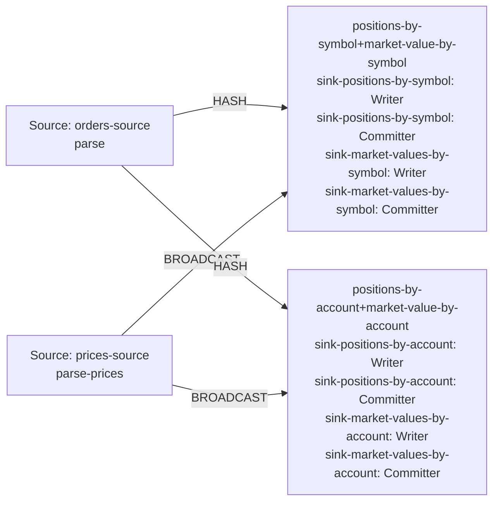

| field | value |
|---|---|
| axis | one machine, more cores: one task manager container capped at N cores, parallelism N, N slots |
| API level | Flink DataStream API, hand-written operators (no SQL, no Table API) |
| guarantee | state: exactly-once checkpointing every 10 s; sink: at-least-once, idempotent by emitting the absolute position per key |
| checkpoint interval | 10000 ms |
| build hash | `0b585bd3f4abe677` (completeness passed for `0b585bd3f4abe677`) |
| passes per case | 3 |
| study | scaling: every case configured identically |
| workload | 300,000,000 records, partitions 8, symbolKeys 4,096, accountKeys 16,384, predictedSymbolKeys 4,096, predictedAccountKeys 16,384, priceRecords 16,384, 5 outputs per input |
| rate source | committed broker offsets on `orders` |
| CPU source | cgroup `cpu.stat usage_usec` |
| suite span | 2026-09-24 15:39:34 -> 2026-09-24 16:19:56 EDT (40m)  dashboard: from=1790278774162&to=1790281196782 |

**1→2 cores: 2.00× (target 1.80×), range 1.89–2.10× across passes.**
**2→4 cores: 1.87× (target 1.80×), range 1.80–1.96× across passes.**

| cores | speed | scaling | pipeline CPU | pipeline memory | Kafka CPU | Kafka memory | blocked by | what to do |
|---:|---:|---:|---|---|---|---|---|---|
| | | what the step into it gave | cores it could use / how much it used | memory it could use / share of the time spent tidying memory up | cores Kafka could use / how much it used | memory Kafka could use / how many times it filled up | | |
| 1 | 128,662/s | — | 1 / 100% | 1536m / 3.1% | 2.5 / 5% | 5.25g, full 808x | Pipeline CPU | check it matches |
| 2 | 257,855/s | 2.00x | 2 / 100% | 2048m / 1.8% | 2.5 / 8% | 5.25g, never full | Pipeline CPU | add cores for more |
| 4 | 481,167/s | 1.87x | 4 / 100% | 3072m / 0.9% | 2.5 / 18% | 5.25g, never full | Pipeline CPU | add cores for more |

| cores | pass | records/s | tm cores | % of cap | throttled | broker cores | src idle | src BP | headroom | vantage |
|---:|---|---:|---:|---:|---:|---:|---:|---:|---:|---:|
| 1 | p1-asc | 128,002 | 1.00 | 99.6% | 100% | 0.11 / 2.5 | 0.0% | 48.4% | 2200 s | 0.27% |
| 2 | p1-asc | 261,113 | 2.00 | 100.1% | 100% | 0.22 / 2.5 | 0.9% | 40.6% | 1007 s | 0.10% |
| 4 | p1-asc | 470,838 | 3.99 | 99.7% | 100% | 0.44 / 2.5 | 1.2% | 27.0% | 482 s | 0.26% |
| 4 | p2-desc | 491,510 | 3.99 | 99.8% | 100% | 0.42 / 2.5 | 1.6% | 25.0% | 462 s | 0.14% |
| 2 | p2-desc | 261,371 | 2.00 | 100.0% | 100% | 0.21 / 2.5 | 0.9% | 40.6% | 998 s | 0.48% |
| 1 | p2-desc | 124,330 | 1.00 | 100.0% | 100% | 0.11 / 2.5 | 0.0% | 48.3% | 2272 s | 0.57% |
| 1 | p3-asc | 132,770 | 1.00 | 99.7% | 100% | 0.12 / 2.5 | 0.1% | 45.7% | 2112 s | 0.28% |
| 2 | p3-asc | 251,082 | 2.00 | 100.3% | 100% | 0.20 / 2.5 | 1.1% | 42.1% | 1041 s | 0.46% |
| 4 | p3-asc | 481,153 | 4.00 | 99.9% | 100% | 0.46 / 2.5 | 1.4% | 27.1% | 466 s | 0.48% |
| 1 | sentinel | 129,546 | 1.00 | 99.7% | 100% | 0.12 / 2.5 | 0.0% | 45.6% | 2173 s | 0.42% |

| cores | passes | mean records/s | spread | reportable |
|---:|---:|---:|---:|---|
| 1 | 4 | 128,662 | 6.6% | yes |
| 2 | 3 | 257,855 | 4.0% | yes |
| 4 | 3 | 481,167 | 4.3% | yes |

Sentinel: the 1-core case first (128,002 rec/s) and last (129,546 rec/s), drift +1.2% across the suite; counted in that case's spread.

### The job graph that ran

Read off the running plan, not drawn. Every case ran this shape — a row whose shape differed would have been thrown out.

