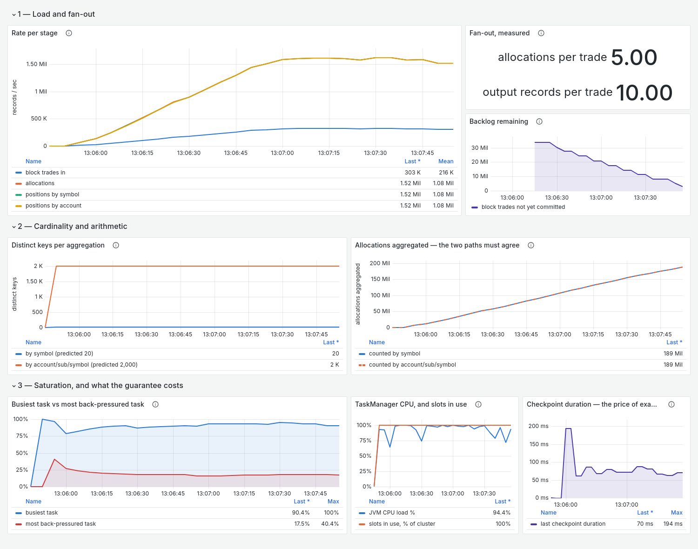

# Clean-room validation, run 3 — with the dashboard

The first run against the skill's observability section. Same conditions as
[run 1](clean-room-run-1.md) and [run 2](clean-room-run-2.md): fresh agent, empty
directory, barred from reading this repository, one prompt, no human input.
Dashboards were in scope this time, and a server-rendered image was required.

**Model: Claude Opus 5.**

## What it cost

| | |
|---|---:|
| Human time | **0 h** |
| Human prompts | **1** |
| Wall clock | 1.74 h |
| Tool calls | 113 |
| Assistant turns | 196 |
| Tokens | 24,071,698 |
| Cost, metered-API equivalent | $36.19 |

## The dashboard it built

Rendered server-side over a window the pipeline was genuinely under load at
parallelism 4. Provisioned from files and verified the hard way — by destroying
the Grafana container entirely and confirming the dashboard came back from the
files alone.

Eight panels in three groups, in the order a talk covers them. The two worth
calling out:

**Fan-out, measured** reads 5.00 allocations per trade and 10.00 output records
per trade. The claim is not asserted anywhere; the dashboard computes it.

**Busiest task vs most back-pressured task** — 90.4% busy against 17.5%
back-pressured — which is the panel that distinguishes a system at its limit and
keeping up from one falling behind.

It also **deleted a panel it had built**: a signed total-shares sum is a random
walk, so a fraction of a second of scrape skew rendered as an alarming 8%
divergence between two paths that were in fact identical. Replaced with a
monotonic count, where the same skew is invisible and a genuinely lost record is
not. That is the skill's "a panel you cannot explain is a liability" catching
something in the wild — and it was found by rendering the image and looking,
which the section tells you to do.

## The scaling table

40,000,000 block trades (12 GB) pre-loaded, producer stopped. Exactly-once,
10s checkpoints, 20 and 2,000 keys predicted before the run.

| cores | trades/s | position updates/s | ratio | TM cores used | broker | back-pressure |
|---|---:|---:|---:|---|---|---:|
| 1 | 82,452 | 824,518 | 1.00× | 0.98 of 1 | 0.42 | 54% |
| 2 | 128,425 | 1,284,254 | 1.56× | 1.80 of 2 | 0.84 | 44% |
| 4 | 288,220 | 2,882,207 | **3.50×** | 3.90 of 4 | 0.75 | 24% |

Descending run agreed within 2.0% / 5.5% / 0.3%. **Vantage points agreed to
100.0% in every case** after it fixed its window anchoring.

The two-core case is the honest wart: 1.56×, with the task manager reaching only
1.80 of its 2 cores. It reported that rather than smoothing it.

### The ceiling

Task manager held at 4 units, broker squeezed: 282,893 → 227,260 → 149,902 →
68,328 at 2.0 / 1.0 / 0.5 / 0.25 broker cores. The handover is unambiguous at
0.5, where the broker pins at 104% of its cap while the task manager falls off
its own — 3.90 cores uncapped, 2.61 at 0.5, 1.37 at 0.25.

## What it refused

At a 0.5-core broker it refused twice — vantage points disagreeing by 16.6%, then
20.0%, *same magnitude and opposite signs*, which is quantisation rather than
bias — and then stopped the suite.

The cause was its own rig: it had anchored the window on the input commit
boundary only, and with a squeezed broker the source's offset commit and the
sinks' transaction commits land far enough apart that the skew *is* the
measurement. It fixed the anchoring, added a guard requiring at least three
boundaries per window, **and re-ran all three suites from scratch so every number
came from one harness version.**

It also caught two commands that succeed without doing anything: `docker update
--cpus 0` does not clear a CPU quota, and a Prometheus reload returned 200 over a
half-written rules file.

## What it sent back into the skill

The content guidance held up — it followed the section verbatim and said so. Five
things it had to work out itself, now added:

- the renderer is a headless browser with **no timezone**
- **verify the provisioned artifact loaded** — the success code lies
- **engine rate meters are smoothed** (~60s), so panels ramp and decay in a way
  that reads as a slow pipeline; a second reason the harness must not read the
  dashboard
- **layout defects are invisible in the JSON** — look specifically for legend
  clipping and disguised second axes
- **per-run identifiers pollute the dashboard too**: consumer groups are the
  transactional-ID trap's twin, and left twenty-two frozen step functions on a
  backlog panel
