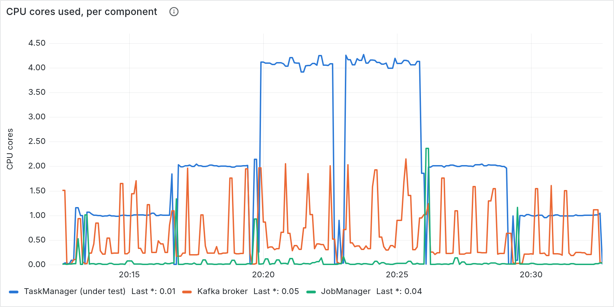

# Clean-room validation, run 4 — Flink SQL, and the trap that would have voided it

The first run after the environment preflight went into the skill. Same
conditions as [1](clean-room-run-1.md), [2](clean-room-run-2.md) and
[3](clean-room-run-3.md): fresh agent, empty directory, barred from this
repository, one prompt, no human input.

**Model: Claude Opus 5.** It chose **Flink SQL** — the first run to do so, and a
choice the skill never asked anyone to make. Question 8 exists because of it.

## What it cost

| | |
|---|---:|
| Human time | **0 h** |
| Human prompts | **1** |
| Wall clock | 1.61 h |
| Tool calls | 141 |
| Cost | $35.65 |

Its own breakdown: ~19 min environment (preflight itself ~7), ~12 min pipeline
and generator, ~25 min harness including hardening after refusals, **~50 min
dashboard**, ~55 min unattended measurement.

## The finding that matters most

**`apache/flink` publishes `amd64` only. The host is `arm64`.**

Every Flink container would have run under emulation — no crash, no warning, no
error — and the whole CPU-scaling study would have been quietly meaningless,
because it would have been measuring a translation layer. It caught this on a
`docker pull` platform warning and switched to the multi-arch Docker Official
image.

*This repository is unaffected: it uses `flink:1.20.4-java17` and all eight of its
images were verified `arm64` native.*

## It corrected the skill's own advice

The skill warned that `docker update --cpus 0` is a no-op that reports success,
and prescribed `--cpu-quota=-1`. **That fix creates a second trap**: it sets a CPU
*period*, after which the daemon rejects every later `--cpus` with *"Nano CPUs
cannot be updated as CPU Period has already been set"*. The harness refused case
2 of 4 and stopped the suite. Right about the no-op, incomplete about the
consequence.

## The scaling table

40,000,000 orders (~12 GB), producer stopped. 8 partitions, 30s at-least-once
checkpoints, 200ms mini-batch, held constant.

| cores | orders/s | allocations/s | × vs 1 | TM cores used | busy | back-pressure |
|---|---:|---:|---:|---|---:|---:|
| 1 | 43,437 | 221,295 | 1.00× | 1.00 of 1 | 100% | 0.0% |
| 2 | 92,268 | 471,425 | 2.12× | 2.00 of 2 | 100% | 0.0% |
| 4 | 164,393 | 856,510 | 3.78× | 4.14 of 4 | 100% | 0.0% |

Averaging each ascending/descending pair: **1.00× / 2.00× / 3.74×**. The
ascending and descending runs differ by 9.5% at one core and 11.6% at two —
right at the ~12% laptop variance the skill predicts, which is why it quotes
ratios and refuses to present absolutes as exact.

The cap pinned flat at 1→2→4→4→2→1 across six cases while the broker never became
the constraint.

## The ceiling

The broker never exceeded 1.32 cores while serving 856,000 allocations/s, and
capping it at 2.0 or even 1.0 cost nothing. Handover at 0.5 cores: the broker
pins at 96% of its cap while the task manager falls from 4.11 to 3.41 and
throughput drops 31%.

**How it fails is the interesting part.** Busy dropped to 76.5% with
back-pressure still at 0.2% — the broker starves the *source*, it does not
back-pressure the sink. A dashboard panel that names only "at the limit" and
"falling behind" reads that as fine.

## What it refused

**Twice, both stopping the suite.** Once because the broker cap could not be
applied (the quota/period trap above). Once — more valuable — because its own
backlog guard was too weak: a case consumed 39,852,303 of 40,000,000 records,
passed a `remaining > 0` check while the source was starved for the tail, and
136,823 orders/s was reported as a fact. The guard now demands a full checkpoint
interval of headroom at the measured rate, and **it re-checked every
already-reported case against the stronger guard** before continuing.

It also removed a column rather than refusing it: the engine's own records-out
counter is not attributable to a physical quantity in a branching topology, and
an unexplainable number does not belong in a results table.

## The dashboard, and the panel it deleted

Nine panels reading `bt:*` recording rules, provisioned so `compose up` produces
them anywhere. Rendered server-side with an explicit timezone.

It deleted its fan-out tile after rendering and looking — three times. The tile
read 319,088.40, then 3.99 in red, then 5.94, against a true 5.00. The cause is
structural: the input counter advances only at commit boundaries while the output
side is continuous, so the ratio lags. Measured at 5.98 (1m), 5.83 (3m), 5.90
(5m) and 6.12 cumulative. **No window fixes a lag**, so the panel went rather
than picking the flattering one.

## What it sent back into the skill

- **check every image's architecture against the host** — the silent invalidator
- **the CPU-quota fix creates a period trap**; pick one mechanism exclusively
- **require backlog headroom, not non-emptiness**
- **back-pressure does not detect starvation** — the pair has three shapes
- **a lagging ratio cannot be fixed by widening the window**

Its own verdict on the preflight: the state-directory, metrics-reporter and JDK
items all saved time, and the highest-value instruction in the whole skill was
*"prove the loop end to end on a tiny input"* — two defects that cost minutes at
200k records would each have cost an hour at 40M.
