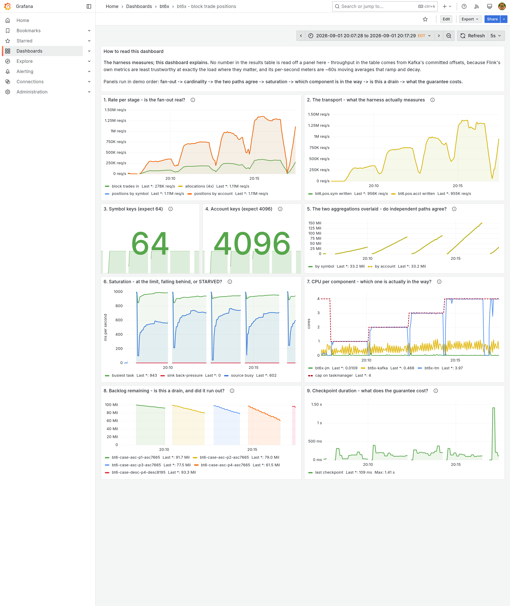
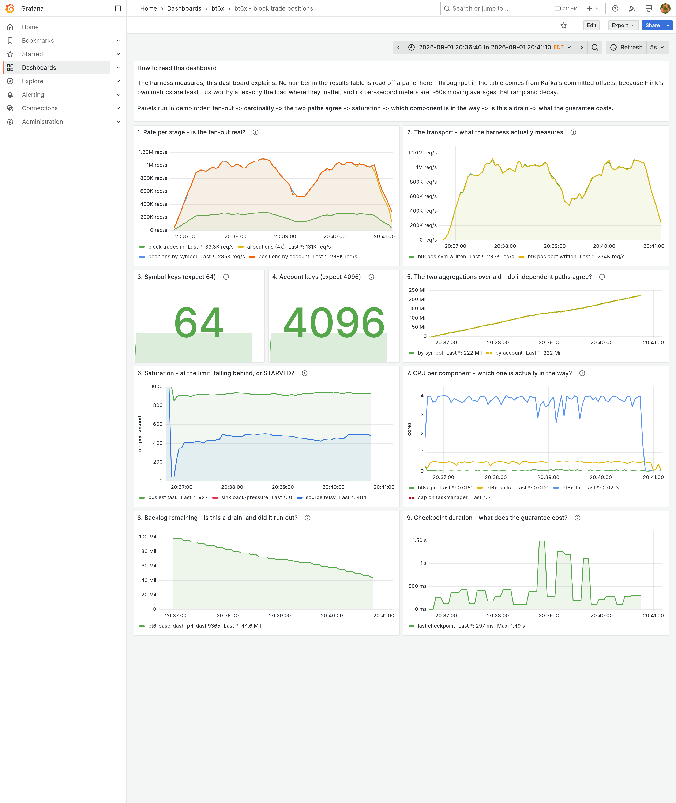

# Clean-room validation, run 6 — the first run with guards instead of prose

The run that tested whether the previous night's conclusion was true: that rules
written as guards get obeyed and rules written as prose do not. Same conditions
as runs [1](clean-room-run-1.md)–[5](clean-room-run-5.md): fresh agent, empty
directory, barred from this repository and every earlier test directory, allowed
only the skill, one prompt, no human input. **DataStream pinned**, as in run 5.

**Model: Claude Opus 5.**

It is the first run to produce a table where the pipeline owned the constraint in
every case — and the first to disprove a claim the skill was teaching.

## What it cost

| | |
|---|---:|
| Human time | **0 h** |
| Human prompts | **1** |
| Wall clock | 1.94 h |
| Tool calls | 120 |
| Assistant turns | 256 |
| Tokens | 47,981,565 |
| Cost, metered-API equivalent | $38.20 |

**The slowest and most expensive of the recent runs**, reversing a four-run trend.
Its own phase breakdown says where:

| phase | wall time | on the critical path? |
|---|---:|---|
| preflight | ~12 min | yes |
| pipeline + tools | ~35 min | partly |
| harness + guards + self-test | ~30 min | **no** — written while backlogs filled |
| dashboard + rules + CI | ~25 min | **no** — written during the ascending suite |
| measurement | ~75 min | **yes, and it is the floor** |
| re-measurement after a defect | ~28 min | yes |

The sequencing rule worked: 55 minutes of harness and dashboard cost nothing in
wall clock. What is exposed is measurement — 75 of the 116 minutes — plus a
28-minute re-run it chose to do and was right to do.

## The table

| cap = par | blocks/s (asc) | blocks/s (desc) | ratio vs 1 | **TM % of cap** | **sink back-pressure** |
|---:|---:|---:|---:|---:|---:|
| 1 | 81,651 | 85,460 | 1.00× | **100.0%** | 0.0 ms/s |
| 2 | 182,025 | 161,299 | 2.23× | **99.9%** | 0.0 ms/s |
| 3 | 223,091 | 196,982 | 2.73× | **99.7%** | 0.0 ms/s |
| 4 | 318,868 | 315,977 | **3.91×** | **100.0%** | 0.0 ms/s |

Mean of the ascending/descending pair at four cores: **3.80×**.

**The two right-hand columns are the point.** Every case sat at 99.6–100% of its
cap with zero sink back-pressure, so the engine was the constraint throughout and
the ratios describe the pipeline rather than something downstream of it. Run 5's
equivalent columns were 94% and 43.6%, which is why its table was withdrawn and
this one stands.

Order effects of +4.7 / −11.4 / −11.7 / −0.9% between the ascending and
descending passes, at the ±12% laptop variance the skill predicts.

**It flagged its own 1→2 step as suspect.** 2.23× is superlinear, and it explained
why rather than banking it: GC runs 31.8 ms/s at one core against 73.7 at four —
a cost that is fixed *per JVM*, not per core, so a single capped core carries
overhead the wider cases amortise. Its recommendation is to quote ratios from two
cores up.

## The ceiling, found by refusal

| case | broker cap | blocks/s | vs uncapped | TM % of cap | broker % of its cap |
|---|---:|---:|---:|---:|---:|
| sq-b2.0 | 2.0 | 306,567 | −3.9% | 99.9% | 38.4% |
| sq-b1.0 | 1.0 | 323,765 | +1.5% | 99.2% | 65.1% |
| **sq-b0.5** | 0.5 | 253,604 | −20.5% | **95.0%** | **95.6%** |

> `REFUSED [constraint-owned] sq-b0.5: taskmanager used 3.80 of 4.00 cores`
> `(95.0% < 95%) — this row is the CEILING, not a data point`

Squeezing the broker to 2.0 and then 1.0 cores cost nothing, both inside noise.
At 0.5 the roles swap and **the harness stopped rather than reporting the row**.
That refusal is the finding: it is the first case in the whole study where the
task manager falls off its own cap.

## The 60-second number is 39% too high

| window | blocks/s | TM % of cap | broker cores (of 8) | sink back-pressure |
|---|---:|---:|---:|---:|
| 60 s | 318,868 | 100.0% | 0.70 | 0.0 ms/s |
| **190 s** | **229,469** | 94.2% | 0.48 | 0.0 ms/s |

Same configuration, longer window, and it was refused for the same reason.

Nothing is back-pressured and the broker uses 0.48 of 8 cores, so it is not CPU
bound either — **the source is starved.** That is the third saturation shape, the
one a throughput graph cannot distinguish from health, and the sustained ceiling
is broker **I/O** rather than broker CPU.

The practical lesson is blunt: a 60-second measurement of this pipeline overstates
what it sustains by 39%, and only a longer window says so.

## Correctness, gating the table

14 assertions, no tolerances, against the generator's manifest: 64 symbol keys
and 4,096 account keys exactly as predicted before building, 1,600,000 rows on
each output, and both aggregation paths agreeing on net position to the unit —
137,329,771 against an expected 137,329,771.

Then the test that matters: **the task manager was killed mid-drain**, recovered
from checkpoint, and 455,888 rows were genuinely replayed. Every per-key final
value was still exactly right and the two paths still agreed.

## The guard set

**14/14 implemented, 56/56 self-tests passing** — every guard broken on purpose
*and* confirmed silent on good input, five of them broken live against the real
cluster. None could not be implemented. It added three more because they caught
something: task manager freshness, no restarts inside a window, and backlog
intact after a destructive command.

Guards that fired for real: **constraint ownership** (twice), **completeness not
passed for this build** (twice), **rows from different builds** (blocking the
table after a rebuild), and **task manager freshness**.

### Three bugs the guards found

**The idempotence claim was wrong — and the skill was teaching it.** Run 5
argued that emitting absolute positions makes replay idempotent, and declined
exactly-once on that basis; the skill wrote it up as an exemplar. Killing the
task manager disproved it: update counts came back 1,604,176 and 1,605,242
against 1,600,000, and the two aggregations disagreed. Absolute emission makes
the *sink* idempotent, but the running sum lives in keyed state, and
at-least-once *checkpointing* does not align barriers, so records already folded
into a snapshot are replayed into it. It split the settings — exactly-once
checkpointing, at-least-once sink — and **re-measured every row on the new jar**,
because rows from two jars are a collection rather than a curve.

**Phantom slots.** `docker rm -f` leaves the job manager advertising a dead task
manager's slots for about 50 seconds. The slot *count* check passed against a
phantom and a job restarted five times onto slots that did not exist. Fixed with
a graceful stop and a new guard checking task manager **identity** rather than
count, reproduced live in the self-test.

**Silent delete failures.** `kafka-consumer-groups.sh --delete` fails while a
member is still unregistering, and the exit code was being swallowed, so stale
groups flat-lined across a dashboard panel. That is the third run to lose time to
a command that reports success and does nothing.

## What DataStream cost and bought

**Cost:** everything by hand — deserializer, positional parser, both output
serializers, both `KeyedProcessFunction`s, state descriptors, metric
registrations. And one hand-written decision produced a wrong measurement:
`disableOperatorChaining()`, added to get per-stage dashboard rates, made six
tasks time-share a one-core cap and reported 35k/s at p1 against 131k/s at p2 — a
3.7× "speedup" that was a pathological baseline. **A planner would not have
offered that lever.**

**Bought:** the fan-out is an explicit `flatMap`, so 8.000 is a property of the
code rather than of a plan — which let the vantage-point guard compare against an
**exact constant** instead of a tolerance. State layout is chosen, so the memory
column has no mystery. And the operator names are its own, which is what let the
back-pressure guard target the *terminal* vertices — the distinction that made
that guard correct rather than approximately correct.

## What it sent back into the skill

- **the sink guarantee and the checkpointing guarantee are two settings** — the
  correction to the exemplar the skill was carrying
- **quote ratios from two cores up**, because fixed per-JVM cost makes a
  single-core baseline flatter everything above it
- **a 60-second window is a 60-second claim** — say so, or measure longer
- **check task manager identity, not slot count** — a dead one advertises slots
  for ~50 s after removal

And the answer to the question it was run to settle. The previous night's
conclusion was that guards get obeyed and prose does not. **This run implemented
all fourteen mandatory guards, self-tested every one, and produced the first
table in six runs where the component under test owned the constraint in every
case.** It also, on the four occasions a guard refused, changed the design rather
than working around the refusal — including throwing away a completed set of
measurements to do it.

The cost of that discipline is visible: 1.94 h against run 5's 1.47 h, and $38.20
against $30.24. **A table that has to be withdrawn is more expensive than either.**
