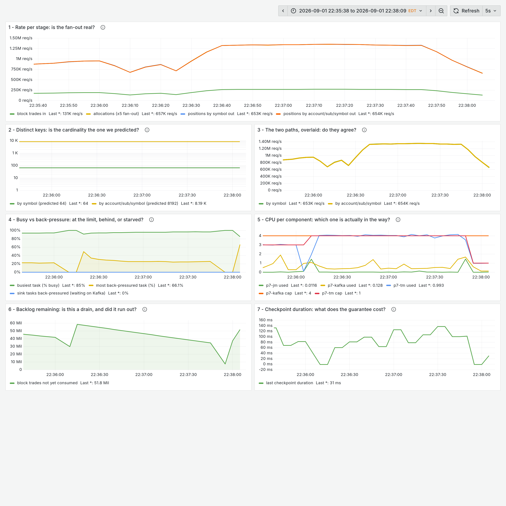

# Clean-room validation, run 7 — half the wall clock, and the guard that was wrong

The run that tested whether the previous night's time findings held, under the
same conditions as runs [1](clean-room-run-1.md)–[6](clean-room-run-6.md): fresh
agent, empty directory, barred from this repository and every earlier test
directory, allowed only the skill, one prompt, no human input. **DataStream
pinned.**

**Model: Claude Opus 5.**

It came in at **55 minutes against run 6's 116**, passed every acceptance
criterion, and then corrected the guard that had been written for it the day
before.

## What it cost

| | |
|---|---:|
| Human time | **0 h** |
| Human prompts | **1** |
| Wall clock | **0.92 h** |
| Tool calls | 98 |
| Assistant turns | 202 |
| Tokens | 28,164,310 |
| Cost, metered-API equivalent | **$22.63** |

The fastest and cheapest of the seven. Run 1 built the same thing in 2.52 h for
$166.58.

## The table

Exactly-once checkpointing, at-least-once sink, both named separately. Checkpoint
interval 10 s constant. Rate from transport committed offsets. One build,
60,000,000-trade backlog, producer stopped.

| case | cap | trades/s | out recs/s | ratio | **% of cap** | commits | sink BP | vantage |
|---|---:|---:|---:|---:|---:|---:|---:|---:|
| p1 | 1 | 82,530 | 825,294 | 1.00× | **100%** | 6 | 0.0 | 0.00% |
| p2 | 2 | 138,280 | 1,384,025 | 1.68× | **100%** | 6 | 0.0 | 0.09% |
| p3 | 3 | 178,089 | 1,783,553 | 2.16× | **102%** | 6 | 0.0 | 0.15% |
| p4 | 4 | 267,734 | 2,681,017 | **3.24×** | **101%** | 7 | 0.0 | 0.14% |

`p1r`, the baseline repeated seven minutes later, came in 4.5% low — which is the
laptop noise the skill predicts, and the reason ratios are quoted rather than
absolutes.

### The 1→2 step is not comparable, and that is the finding

Read the steps rather than the ratios against the baseline:

| step | × previous | efficiency |
|---|---:|---:|
| p1 → p2 | 1.68× | 84% |
| **p2 → p4** | **1.94×** | **97%** |

**This pipeline scales almost perfectly from two cores up.** The headline 3.24× is
dragged down by a baseline that did structurally less work: at parallelism 1 a
`keyBy` repartitions nothing — no network hop, no serialization between subtasks
— and every case above pays that cost.

Run 6 has the mirror image: 2.23× at 1→2, superlinear, from fixed per-JVM cost
dominating a single capped core; then 1.75× from 2 to 4. **Both runs reported the
1→4 ratio as the result, and in both the honest number was measured from two
cores up.** That produced a new rule: the baseline is a case, not a reference
point.

## The ceiling

Holding the task manager at 4 cores and squeezing the broker: at 1.0 core the
broker cost 7% of throughput. At 0.5 the handover is unambiguous —

> `CEILING: used 2.97 of 4.00 cores (74% of cap) — this row is the ceiling, not a
> data point`

Broker pinned at **0.50 of 0.50 cores (100%)** while the task manager fell to
**2.98 of 4.00 (74%)** and throughput halved to ~141,921 trades/s. Busy fell with
sink back-pressure still at 0.0%: the **starved** shape, not back-pressure.

At p4 the broker used 0.70 cores serving 2.68M records/s — about a fifth of what
would saturate it, which is what says how much further this would go on more
engine cores.

## Where the time went

**55 minutes, against 116.** The suite itself:

| | run 6 | run 7 |
|---|---:|---:|
| Per-case overhead | 67 s | **14 s** |
| Time inside windows | 51% | **55%** |
| Suite total | 22.7 min | **12.7 min** |

It **asserted** warm-up to steady rather than sleeping — submit→steady varied
28–53 s across cases, which is exactly why a fixed 40-second sleep was waste. The
gap from one window close to the next submit was 4–8 seconds.

The two avoidable losses:

- **13 min re-running the suite because the backlog was undersized.** The skill
  said "size for the longest single case plus headroom", which warns about
  over-filling; under-filling cost far more. The arithmetic that works is
  `top predicted rate × (submit + warm-up + window + one checkpoint interval)`.
- **8 min finding rig defects one 100-second case at a time** — three of them in
  harness code that only executes *after* a window closes.

Its own answer to what would save the most next time: size the backlog from case
arithmetic before filling anything.

## The guard set, and the guard that was wrong

All 14 implemented, **28 self-tests, 0 failures**. Five real refusals, none worked
around.

**The constraint-ownership guard refused a correct baseline.** Written the day
before as "no material back-pressure", with no statement of *where* to measure it.
The obvious reading — maximum over all tasks — is wrong: inside a CPU-capped
single-slot task manager the source always waits on the aggregation threads
sharing that core. It measured **25–46% internal back-pressure in every one of its
six good cases** while sink back-pressure stayed at **0.0%**, diagnosed the guard
rather than relaxing the threshold, and rescoped it to the external boundary.

Its own verdict is the sharpest sentence any run has produced:

> All four of my real refusals were guards, and the one rule I had implemented
> from prose rather than thought through — where to measure back-pressure — is
> the one that misfired.

The other four refusals: a refused case left its job holding the cluster (so the
next refused on "cluster not idle" — two refusals, one cause); cardinality read
`-1` because Flink silently sanitises `position-by-symbol` to
`position_by_symbol`; a slot-count race where `/overview` lags the RUNNING
transition; and vantage points disagreeing by 18.6% at p3, which found the
undersized backlog. It fixed the **rig** for that one and re-ran every case,
because the earlier rows had been measured against a different window length.

Completeness also failed for real once — every key exactly 2×, because the topic
still held the previous attempt's records.

## What it sent back into the skill

- **measure back-pressure at the external boundary**, and report the internal
  figure without gating on it
- **the baseline is a case, not a reference point** — at parallelism 1 there is no
  shuffle
- **a refused case tears its job down on every exit path**, not only the happy one
- **run the whole case path once at a 10–15 second window** before the suite: the
  tiny proof exercises the pipeline, and the harness is where the defects are
- **size the backlog from case arithmetic**, not from a guess about the longest
  case
- engines rewrite metric label *values*, and stale series outlive a case, so pin
  every cross-case query to the run's own job identity
- **mount the directory, not the file** — a single-file bind mount served a rules
  file truncated by six bytes

## The one it broke

Its container-CPU sampler was still running on the host 44 minutes after the run
finished. The teardown assertion covers processes the *harness* spawned, and this
one was started outside it. **That is the third consecutive run to leave a monitor
behind**, against a rule that has been in the skill since run 2 — which is the
clearest evidence yet that the rule needs to be a property of how monitors are
started, not an instruction to remember at the end.
