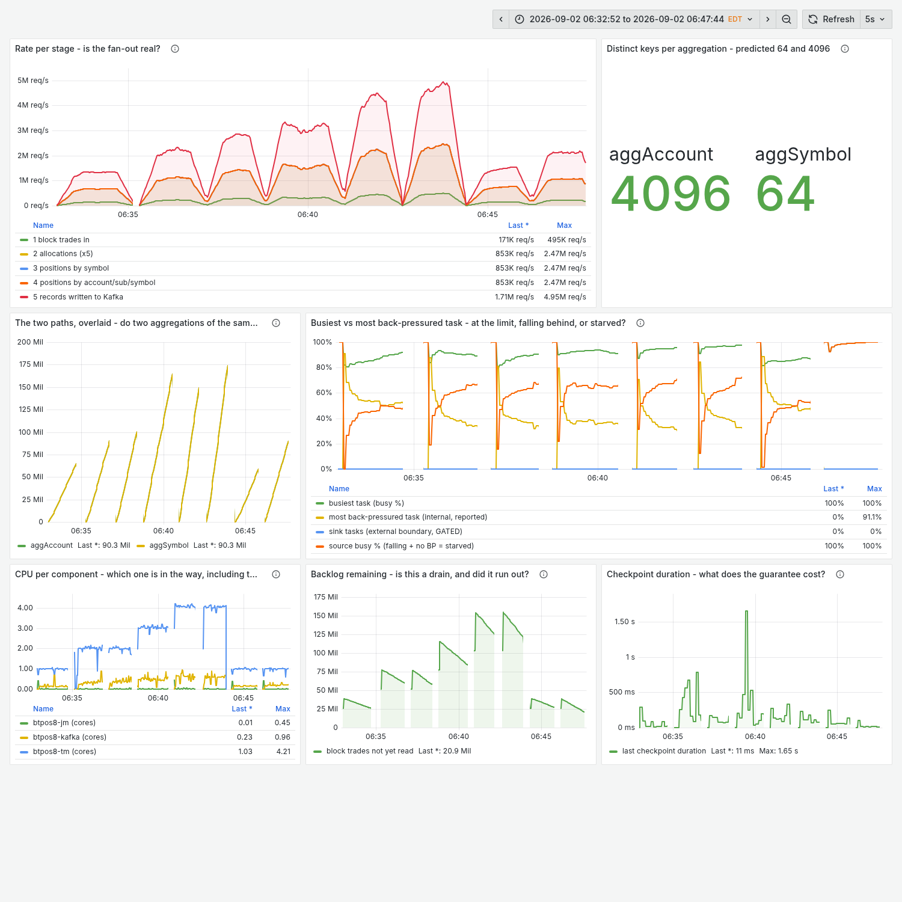
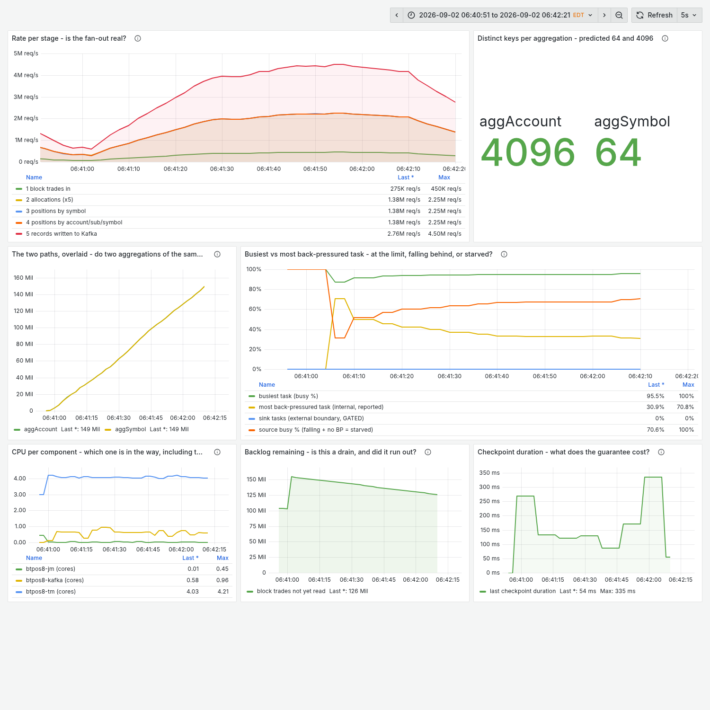

# Clean-room validation, run 8 — the comparable baseline, measured

Run 8 was given one question the earlier runs could only be compared *about*:
**can this pipeline demonstrate linear scaling from 1 to 4 cores, with a baseline
that runs the same program as every case above it?**

Same conditions as runs [1](clean-room-run-1.md)–[7](clean-room-run-7.md): fresh
agent, empty directory, barred from this repository, every earlier test directory
and the preserved results, allowed only the skill, one prompt, no human input.
**DataStream pinned.**

**Model: Claude Opus 5.**

## What it cost

| | |
|---|---:|
| Human time | **0 h** |
| Human prompts | **1** |
| Wall clock | 1.59 h |
| Tool calls | 92 |
| Tokens | 25,910,578 |
| Cost, metered-API equivalent | $26.39 |

Slower than [run 7](clean-room-run-7.md)'s 55 minutes, and it says why without
being asked: 8 minutes were pure waste, and ~26 minutes were two extra repeat
passes and a broker squeeze it added deliberately, **because single samples with a
16% spread cannot answer the question it was set.** That was the right call.

## The answer: no, and the honest number is the step

| step | ratio | efficiency |
|---|---:|---:|
| 1 → 2 | 1.82× | 91% |
| 2 → 3 | 1.38× | 92% |
| **3 → 4** | **1.30×** | **98%** |
| **2 → 4** | **1.79×** | **90%** |
| 1 → 4 | 3.26× | 81% |

Mean of **three independent passes of every case**, one build, checkpoint interval
10 s constant, rate from committed offsets.

| case | cap | TM used | % of cap | blocks/s | output rec/s | sink BP | internal BP | broker |
|---|---:|---:|---:|---:|---:|---:|---:|---:|
| p1 | 1 | 0.99 | 98.9% | 140,308 | 1,392,525 | 0.0 | 50–57% | 0.15 |
| p2 | 2 | 1.94–1.98 | 96.8–98.8% | 255,280 | 2,528,446 | 0.0 | 36–42% | 0.36 |
| p3 | 3 | 2.96–2.99 | 98.8–99.8% | 351,299 | 3,498,305 | 0.0 | 32–39% | 0.47 |
| p4 | 4 | 3.97–3.99 | 99.3–99.8% | 457,264 | 4,549,596 | 0.0 | 34–41% | 0.60 |

All 14 rows ≥96.2% of cap. **Run-to-run spread 10–17%**, reported rather than
hidden — which is the most quietly damaging finding in the record, because every
table in runs 1–7 is a single sample.

## The experiment: what comparability costs

| baseline | graph at parallelism 1 | blocks/s | 1→4 |
|---|---|---:|---:|
| **comparable** | 3 vertices, both keyed edges `HASH`, serialized across the shuffle — identical to every case above | 140,308 | **3.26×** |
| naive | 1 vertex, both edges `FORWARD`, fully chained, no shuffle | 211,533 | **2.16×** |

**Forcing comparability cost the baseline 33.7% of its throughput and raised the
headline ratio by 1.10×.** One machine, one build, changing only the ship strategy
on two keyed edges — identical operators, state, checkpointing and object reuse.

That is the perverse incentive measured directly rather than inferred: the more
honest baseline reports the better-looking number, and neither figure is a lie.

It also made comparability a **guard**. The harness reads the ship strategies off
the running job's plan and refuses any row whose graph is not the
three-vertex/two-`HASH` shape.

## No plateau, and the ceiling is the engine

At p4 the task manager sits at 99.3–99.8% of cap with **77–86 seconds of CPU
throttling inside a 50-second window**, sink back-pressure 0.0%, broker at 0.60 of
8 cores. Squeezing the broker instead of buying units:

| broker cap | broker used | broker % of cap | TM % of cap | blocks/s |
|---:|---:|---:|---:|---:|
| 2.0 | 0.55 | 28% | 99.6% | 400,043 |
| 1.0 | 0.58 | 58% | 96.9% | 435,514 |
| 0.5 | 0.46 | **92%** | 98.1% | 378,403 |

The broker only pins at 0.5 cores and costs ~16% there. Unconstrained it runs at
**13× headroom**. The transport is not the ceiling on this rig; the engine's CPU
cap is, and the next one would be the host's remaining four physical cores.

**This also disproved a hypothesis from the record.** Runs 6 and 7 both landed near
2.6M output records/s at four cores, and that convergence looked like a shared
machine ceiling. Run 8 reaches **4,549,596 — 1.70× that.** There was no shared
ceiling; the earlier runs were simply slower.

## What it refused

Four kinds, every one tearing the job and task manager down and stopping the
suite.

- **Constraint not owned** at 94.4% of cap — and the root cause was the
  *measurement*: `docker stats` is too coarse to attribute a CPU cap on a
  VM-backed engine. Replaced with the container's cumulative cgroup counter,
  which read 97.8% for the same case.
- **Too few commit boundaries** — window widened.
- **Vantage points disagreeing, three times.** Fixed properly by opening and
  closing every window on the event that the source's **committed offset actually
  advanced**, so both ends are the same kind of event.
- **Slots ≠ parallelism** — a race where `/overview` reports a free slot after the
  job reports RUNNING.

All 15 mandatory guards implemented and self-tested across 29 checks, each
confirmed both to fire on a bad value and to accept a good one. It added five
more of its own, including the job-graph comparability guard and the 1.5×–2.5×
superlinearity bound in the dry run.

## What it sent back into the skill

The largest is a correction to text written for it two runs earlier:

> **"At parallelism 1 a `keyBy` repartitions nothing."** This is misleading for
> Flink specifically. A `keyBy` at p1 still produces a `HASH` edge that is not
> chained and *does* serialize. The real asymmetry is that at p1 you can
> legitimately write a *different* program. The skill's advice to "force a
> rebalance at parallelism 1" would have changed nothing measurable.

The conclusion survived and the mechanism did not — and the prescribed fix was a
no-op, which is worse than no advice.

- **read CPU from a cumulative cgroup counter, never `docker stats`**;
  `throttled_usec` is free evidence the cap binds
- **anchor on the committed offset advancing**, not on the checkpoint completing
- **warm-up needs a trend over four intervals**, not two samples within a few
  percent — a drain oscillates ±10% and two neighbours agreeing is luck
- **the dry run must fire a refusal on purpose.** Its own `Refusal` existed as two
  distinct classes, so every refusal escaped its handler as an unhandled
  traceback — a harness whose refusals do not refuse
- **assert a background process is alive before waiting on it** — eight minutes
  spent waiting on something that died instantly on an argument-parsing error
- **one sample is not a measurement**

## The one it broke

Its container-CPU sampler was still running on the host after the run finished —
**the fourth consecutive run to leave a monitor behind**, against a rule in the
skill since run 2. Every offender was started on the host, outside the harness,
where a teardown assertion cannot see it. The rule needs to become a property of
how monitors are started rather than an instruction to remember at the end.
