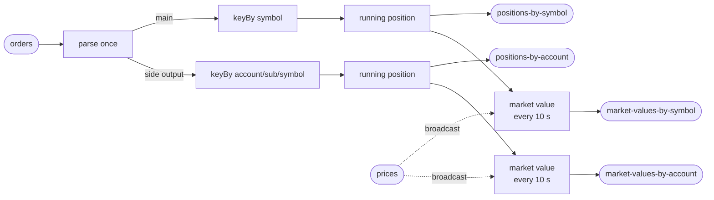

# The plan

**Nobody approved this.** Section 1a of the skill asks for the plan to be
shown and a yes collected before anything is built. No human is available for
this run, so the plan is written down anyway and built against, and this line
is here so a reader can tell agreement from assumption. It was written before
any number existed.

## What is being claimed

Near-linear scaling of one Flink worker across 1, 2 and 4 cores, on one
laptop, on a position-keeping pipeline. Two steps are reported, **1 to 2** and
**2 to 4**, and each must return **1.90x or better** on a doubling. The step
someone would buy — 2 to 4 — leads.

## Everything that was decided without being asked

| | |
|---|---|
| the objective | near-linear scaling across 1, 2 and 4 cores. Each step must return 1.90x or better on a doubling. Two steps are reported, 1 to 2 and 2 to 4 |
| where it runs | this laptop, in Docker. 8 CPUs, 16 GB of host memory, a Docker virtual machine of 9,937 MiB |
| the stack | `flink:1.20.1-scala_2.12-java17` and `apache/kafka:3.9.0`, plus Grafana, Prometheus and a small container-CPU exporter for the dashboard |
| what is measured | the drain rate of a fixed backlog at each core count, read from committed broker offsets, with the resource columns beside it |
| what is proved first | completeness with no tolerances, re-checked after killing the pipeline mid-run. No throughput table is published for a build that has not passed |
| what is built | the pipeline, a deterministic generator, a verifier, and the dashboard |
| the shape of the suite | 3 passes per case over 3 cases, ascending then descending then ascending, then the baseline once more as a drift check: **10 cases**. That is most of the wall clock |
| the guarantee | **exactly-once checkpointing** at a **10,000 ms** interval, and an **at-least-once sink made idempotent by emitting the absolute position per key** |
| how long it takes | **two to three hours** on this machine, and most of it is silent |
| what it writes | three backlogs on the broker — 150,000,000 records for the suite, 90,000,000 for the tiny proof, 8,000,000 for completeness. At about 175 bytes a record that is roughly **26 GB, 16 GB and 1.4 GB of Kafka log**, plus the output topics, which are capped by retention. Host free disk is 124 GB and is checked before every case |
| what it occupies | ports 19092, 18081, 13000, 19090 and 19110; 8 partitions on every topic; every container, volume and network prefixed `st47` |
| where to watch it | `results/PROGRESS.txt` — one sentence, overwritten: which step of seven, which case of ten, and roughly how long is left |

**Nobody can be spoken to while this runs.** This is a detached agent with no
channel to a person until it finishes. So no progress messages are promised.
`results/PROGRESS.txt` is where the run is, and whoever started it is the one
who can read it.

## The pipeline

Two inputs, four outputs. `orders` is the input the harness fills, measures
and drains; `prices` is mine and the harness is told nothing about it.

The order is parsed **once** and fanned out through a side output, not read
twice and not parsed twice — section 6a's largest single lever, taken at the
start rather than as a fix.

Prices are broadcast rather than keyed, because the account side is keyed on
account / sub-account / symbol and cannot be joined to a symbol-keyed price
stream by key at all.

## The design the run will be held to

Declared in `pipeline.json` under `design`, and diffed against the running
job by the completeness step. Declared and missing stops the run.

- operators: `parse`, `position-by-symbol`, `position-by-account`,
  `market-value-by-symbol`, `market-value-by-account`
- inputs: `orders`, `prices`
- outputs: `positions-by-symbol`, `positions-by-account`,
  `market-values-by-symbol`, `market-values-by-account`

## How it is measured

`harness/prove.py all`, detached, waited on through `results/DONE`. The
harness is used as it ships. Nothing here writes a sampler, a suite runner, a
spread rule, a warm-up rule or a report table.

The chain is `up -> preflight -> completeness -> tinyproof -> fill -> suite ->
report`, and it stops at the first step that does not pass.

Before that chain runs, `up` and `preflight` are run once on their own for one
reason: the key-layout row measures where 4 symbol keys and 16 account keys
land and **names the `pipeline.max-parallelism` that evens them out**, and
`flinkProperties` is read when the stack comes up, so a setting added
afterwards would reach nothing and say nothing. The number goes into
`pipeline.json`, the stack comes down, and the chain starts from a clean
`up`.

## What would make this stop, and what that would mean

- The largest case cannot hold its cap because the broker and the worker do
  not both fit the virtual machine. Then the 4-core case comes back as a
  **ceiling** — measured, reported as where scaling stops, and left out of the
  ratios. That is a result, not a failure.
- A step comes back under 1.90x. Then the tuning loop in section 6a runs, one
  change at a time, each with its prediction written in `FIXES.md` before it
  is measured, reverted if the step got worse, and stopping after four.
- The design diff finds an output nothing writes. Then the build is corrected
  and completeness runs again. No fill and no suite until the two agree.

## Estimated cost

About two to three hours of this laptop, of which the suite is roughly 45
minutes and the two fills about 15. The rest is the build, the completeness
drains and the tiny proof.
