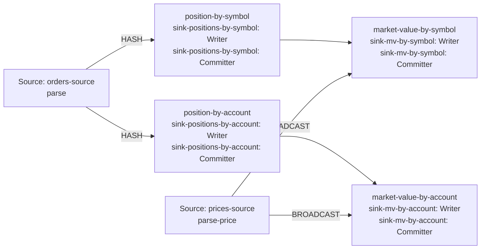

| field | value |
|---|---|
| axis | one worker growing: one task manager container capped at N cores, parallelism N, N slots |
| API level | Flink DataStream API, hand-written operators (no SQL, no Table API) |
| guarantee | state: exactly-once checkpointing; sink: at-least-once, idempotent by publishing the absolute position per key |
| checkpoint interval | 10000 ms |
| build hash | `3f6c398464479ec2` (completeness passed for `3f6c398464479ec2`) |
| passes per case | 3 |
| study | scaling: every case configured identically |
| workload | 165,000,000 records, allocationsPerOrder 4, outputRowsPerOrder 5, symbolKeyCount 4, accountKeyCount 16, totalQuantity 10,890,029,626, priceRecordsPerSymbol 8, 5 outputs per input |
| rate source | committed broker offsets on `orders` |
| CPU source | cgroup `cpu.stat usage_usec` |
| suite span | 2026-09-23 19:45:10 -> 2026-09-23 20:51:51 EDT (1h 07m)  dashboard: from=1790207110011&to=1790211111698 |

**1→2 cores: not reported — voided: 1c its readings are 54% apart and the limit is 20%; 2c its readings are 71% apart and the limit is 20%.**
**2→4 cores: not reported — voided: 2c its readings are 71% apart and the limit is 20%; 4c its readings are 147% apart and the limit is 20%.**

| cores | speed | scaling | pipeline CPU | pipeline memory | Kafka CPU | Kafka memory | blocked by | what to do |
|---:|---:|---:|---|---|---|---|---|---|
| | | what the step into it gave | cores it could use / how much it used | memory it could use / share of the time spent tidying memory up | cores Kafka could use / how much it used | memory Kafka could use / how many times it filled up | | |
| 1 \* | 97,863/s | — | 1 / 100% | 1664m / 1.7% | 2.5 / 7% | 4.5g, full 4,996x | Pipeline CPU | check it matches |
| 2 \* | 168,300/s | — | 2 / 100% | 2304m / 1.1% | 2.5 / 25% | 4.5g, full 5,050x | Pipeline CPU | no usable step |
| 4 \* | 242,923/s | — | 4 / 98% | 3584m / 0.4% | 2.5 / 41% | 4.5g, never full | Pipeline CPU | no usable step |

| cores | pass | records/s | tm cores | % of cap | throttled | broker cores | src idle | src BP | headroom | vantage |
|---:|---|---:|---:|---:|---:|---:|---:|---:|---:|---:|
| 1 | p1-asc **(ceiling)** | 127,164 | 0.98 | 98.2% | 100% | 0.16 / 2.5 | 0.3% | 27.9% | 1163 s | 0.26% |
| 2 | p1-asc | 208,245 | 1.99 | 99.7% | 99% | 0.38 / 2.5 | 2.4% | 25.9% | 651 s | 0.10% |
| 4 | p1-asc | 115,234 | 3.95 | 98.7% | 94% | 1.09 / 2.5 | 0.9% | 33.2% | 1208 s | 0.13% |
| 4 | p2-desc | 473,467 | 3.98 | 99.4% | 98% | 0.57 / 2.5 | 1.8% | 23.5% | 156 s | 0.04% |
| 2 | p2-desc | 207,698 | 2.01 | 100.5% | 100% | 0.31 / 2.5 | 2.1% | 26.1% | 650 s | 0.10% |
| 1 | p2-desc | 116,620 | 1.00 | 100.5% | 100% | 0.15 / 2.5 | 0.0% | 34.1% | 1256 s | 0.29% |
| 1 | p3-asc | 63,528 | 1.00 | 100.4% | 100% | 0.31 / 2.5 | 0.5% | 33.3% | 2371 s | 0.12% |
| 2 | p3-asc | 88,955 | 2.01 | 100.3% | 100% | 0.62 / 2.5 | 2.2% | 26.7% | 1644 s | 0.54% |
| 4 | p3-asc | 140,069 | 3.91 | 97.8% | 92% | 1.02 / 2.5 | 1.3% | 27.4% | 851 s | 0.03% |
| 1 | sentinel | 113,442 | 1.00 | 100.0% | 100% | 0.17 / 2.5 | 0.4% | 31.8% | 1301 s | 0.20% |

| cores | passes | mean records/s | spread | reportable |
|---:|---:|---:|---:|---|
| 1 | 3 | 97,863 | 54.2% | no — its readings are 54% apart and the limit is 20% |
| 2 | 3 | 168,300 | 70.9% | no — its readings are 71% apart and the limit is 20% |
| 4 | 3 | 242,923 | 147.5% | no — its readings are 147% apart and the limit is 20% |

Sentinel: the 1-core case first (116,620 rec/s) and last (113,442 rec/s), drift -2.8% across the suite; counted in that case's spread.

### The job graph that ran

Read off the running plan, not drawn. Every case ran this shape — a row whose shape differed would have been thrown out.

