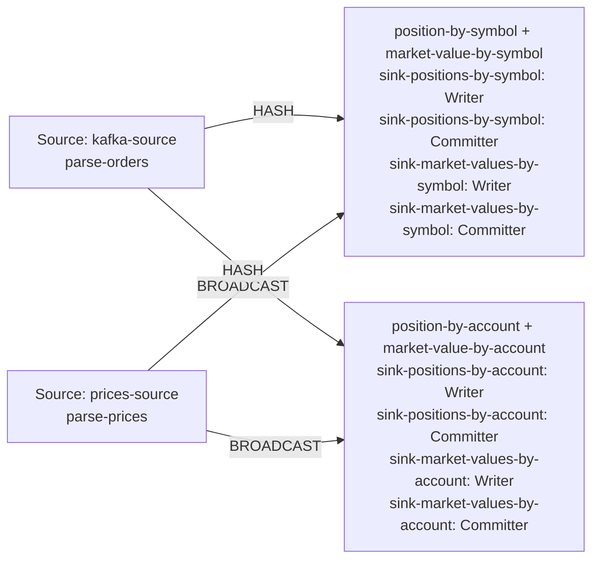

| field | value |
|---|---|
| axis | one machine, more cores: one task manager container capped at N cores, parallelism N, N slots |
| API level | Flink DataStream API (question 5 default), hand-written keyed broadcast operators, no SQL or Table API |
| guarantee | state: exactly-once checkpointing every 10 s; sink: at-least-once Kafka sink, idempotent by emitting the absolute position per key; duplicates dropped by per-symbol sequence |
| checkpoint interval | 10000 ms |
| build hash | `12d4d5de99ecf590` (completeness passed for `12d4d5de99ecf590`) |
| passes per case | 3 |
| study | scaling: every case configured identically |
| workload | 250,000,000 records, accountKeys 16,384, duplicateRecords 1,247,403, partitions 8, priceRecords 16,384, symbolKeys 4,096, uniqueOrders 248,752,597, 5 outputs per input |
| rate source | committed broker offsets on `orders` |
| CPU source | cgroup `cpu.stat usage_usec` |
| suite span | 2026-09-24 07:05:51 -> 2026-09-24 07:45:30 EDT (40m)  dashboard: from=1790247951610&to=1790250330182 |

**1→2 cores: 1.81× (target 1.90×), range 1.73–1.93× across passes.**
**2→4 cores: 1.94× (target 1.90×), range 1.89–2.01× across passes.**

| cores | speed | scaling | pipeline CPU | pipeline memory | Kafka CPU | Kafka memory | blocked by | what to do |
|---:|---:|---:|---|---|---|---|---|---|
| | | what the step into it gave | cores it could use / how much it used | memory it could use / share of the time spent tidying memory up | cores Kafka could use / how much it used | memory Kafka could use / how many times it filled up | | |
| 1 | 134,762/s | — | 1 / 98% | 1536m / 3.3% | 2.5 / 5% | 5g, full 1,494x | Kafka memory | raise kafkaMemory |
| 2 | 244,437/s | 1.81x | 2 / 100% | 2048m / 1.2% | 2.5 / 9% | 5g, never full | Pipeline CPU | check the host |
| 4 | 475,278/s | 1.94x | 4 / 100% | 3072m / 1.0% | 2.5 / 20% | 5g, never full | Pipeline CPU | check the host |

**1 core:** Kafka's memory, blocking higher throughput. Kafka hit its limit 1,494 times and had to read the test data back off disk, so the pipeline was waiting on Kafka rather than using its CPU.

| cores | pass | records/s | tm cores | % of cap | throttled | broker cores | src idle | src BP | headroom | vantage |
|---:|---|---:|---:|---:|---:|---:|---:|---:|---:|---:|
| 1 | p1-asc | 129,516 | 1.00 | 99.8% | 100% | 0.13 / 2.5 | 0.0% | 27.2% | 1783 s | 0.44% |
| 2 | p1-asc | 249,317 | 2.01 | 100.4% | 100% | 0.23 / 2.5 | 0.7% | 20.8% | 833 s | 0.05% |
| 4 | p1-asc | 470,555 | 3.97 | 99.2% | 100% | 0.47 / 2.5 | 2.2% | 12.9% | 386 s | 0.12% |
| 4 | p2-desc | 476,895 | 3.83 | 95.7% | 99% | 0.45 / 2.5 | 1.7% | 15.9% | 386 s | 0.10% |
| 2 | p2-desc | 245,570 | 2.01 | 100.3% | 100% | 0.23 / 2.5 | 0.6% | 21.4% | 868 s | 0.29% |
| 1 | p2-desc | 137,046 | 0.99 | 99.1% | 100% | 0.12 / 2.5 | 0.0% | 25.5% | 1683 s | 0.28% |
| 1 | p3-asc | 137,723 | 1.00 | 100.2% | 100% | 0.13 / 2.5 | 0.1% | 27.8% | 1678 s | 0.15% |
| 2 | p3-asc | 238,424 | 2.00 | 100.2% | 100% | 0.22 / 2.5 | 0.3% | 31.3% | 910 s | 0.08% |
| 4 | p3-asc | 478,384 | 4.00 | 100.1% | 99% | 0.49 / 2.5 | 2.6% | 12.9% | 376 s | 0.14% |
| 1 | sentinel **(ceiling)** | 130,915 | 0.98 | 97.9% | 100% | 0.13 / 2.5 | 0.1% | 30.3% | 1780 s | 0.32% |

| cores | passes | mean records/s | spread | reportable |
|---:|---:|---:|---:|---|
| 1 | 3 | 134,762 | 6.1% | yes |
| 2 | 3 | 244,437 | 4.5% | yes |
| 4 | 3 | 475,278 | 1.7% | yes |

### The job graph that ran

Read off the running plan, not drawn. Every case ran this shape — a row whose shape differed would have been thrown out.

