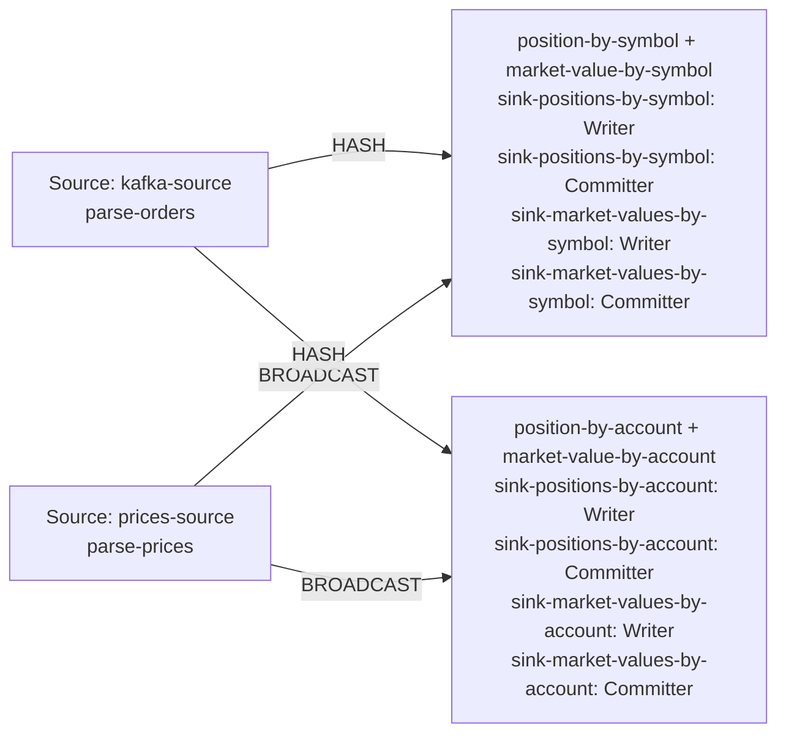

| field | value |
|---|---|
| axis | one machine, more cores: one task manager container capped at N cores, parallelism N, N slots |
| API level | Flink DataStream API (question 5 default), hand-written keyed broadcast operators, no SQL or Table API |
| guarantee | state: exactly-once checkpointing every 10 s; sink: at-least-once Kafka sink, idempotent by emitting the absolute position per key; duplicates dropped by per-symbol sequence |
| checkpoint interval | 10000 ms |
| build hash | `12d4d5de99ecf590` (completeness passed for `12d4d5de99ecf590`) |
| passes per case | 3 |
| study | scaling: every case configured identically |
| workload | 250,000,000 records, accountKeys 16,384, duplicateRecords 1,247,403, partitions 8, priceRecords 16,384, symbolKeys 4,096, uniqueOrders 248,752,597, 5 outputs per input |
| rate source | committed broker offsets on `orders` |
| CPU source | cgroup `cpu.stat usage_usec` |
| suite span | 2026-09-24 08:37:36 -> 2026-09-24 09:16:56 EDT (39m)  dashboard: from=1790253456930&to=1790255816018 |

**1→2 cores: 1.85× (target 1.90×), range 1.80–1.90× across passes.**
**2→4 cores: 1.94× (target 1.90×), range 1.84–2.05× across passes.**

| cores | speed | scaling | pipeline CPU | pipeline memory | Kafka CPU | Kafka memory | blocked by | what to do |
|---:|---:|---:|---|---|---|---|---|---|
| | | what the step into it gave | cores it could use / how much it used | memory it could use / share of the time spent tidying memory up | cores Kafka could use / how much it used | memory Kafka could use / how many times it filled up | | |
| 1 | 130,030/s | — | 1 / 100% | 1536m / 3.7% | 2.5 / 5% | 5g, full 1,791x | Pipeline CPU | check it matches |
| 2 | 240,684/s | 1.85x | 2 / 100% | 2048m / 1.8% | 2.5 / 9% | 5g, never full | Pipeline CPU | check the host |
| 4 | 466,878/s | 1.94x | 4 / 98% | 3072m / 0.8% | 2.5 / 19% | 5g, never full | Pipeline CPU | check the host |

| cores | pass | records/s | tm cores | % of cap | throttled | broker cores | src idle | src BP | headroom | vantage |
|---:|---|---:|---:|---:|---:|---:|---:|---:|---:|---:|
| 1 | p1-asc | 129,601 | 1.00 | 99.8% | 100% | 0.13 / 2.5 | 0.3% | 27.7% | 1789 s | 0.31% |
| 2 | p1-asc | 241,251 | 2.01 | 100.4% | 100% | 0.26 / 2.5 | 0.9% | 22.1% | 894 s | 0.27% |
| 4 | p1-asc | 480,765 | 3.90 | 97.5% | 100% | 0.51 / 2.5 | 2.4% | 13.6% | 375 s | 0.25% |
| 4 | p2-desc **(ceiling)** | 436,981 | 3.75 | 93.8% | 98% | 0.47 / 2.5 | 2.9% | 12.8% | 428 s | 0.24% |
| 2 | p2-desc | 234,637 | 1.90 | 95.1% | 100% | 0.21 / 2.5 | 0.6% | 22.6% | 930 s | 0.23% |
| 1 | p2-desc **(ceiling)** | 125,597 | 0.95 | 94.7% | 100% | 0.13 / 2.5 | 0.0% | 25.7% | 1859 s | 0.41% |
| 1 | p3-asc **(ceiling)** | 129,686 | 0.98 | 97.8% | 100% | 0.12 / 2.5 | 0.0% | 25.6% | 1796 s | 0.15% |
| 2 | p3-asc | 246,165 | 2.00 | 100.0% | 100% | 0.23 / 2.5 | 0.8% | 24.4% | 874 s | 0.29% |
| 4 | p3-asc | 452,991 | 3.92 | 98.1% | 97% | 0.48 / 2.5 | 4.2% | 12.8% | 397 s | 0.67% |
| 1 | sentinel | 130,460 | 1.00 | 99.8% | 100% | 0.13 / 2.5 | 0.0% | 27.7% | 1779 s | 0.40% |

| cores | passes | mean records/s | spread | reportable |
|---:|---:|---:|---:|---|
| 1 | 2 | 130,030 | 0.7% | yes |
| 2 | 3 | 240,684 | 4.8% | yes |
| 4 | 2 | 466,878 | 5.9% | yes |

Sentinel: the 1-core case first (129,601 rec/s) and last (130,460 rec/s), drift +0.7% across the suite; counted in that case's spread.

### The job graph that ran

Read off the running plan, not drawn. Every case ran this shape — a row whose shape differed would have been thrown out.

