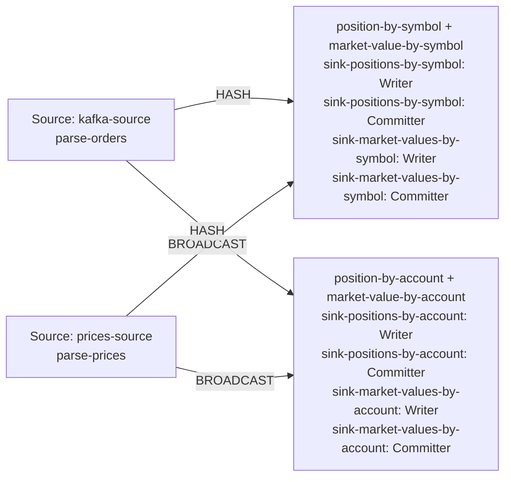

| field | value |
|---|---|
| axis | one machine, more cores: one task manager container capped at N cores, parallelism N, N slots |
| API level | Flink DataStream API (question 5 default), hand-written keyed broadcast operators, no SQL or Table API |
| guarantee | state: exactly-once checkpointing every 10 s; sink: at-least-once Kafka sink, idempotent by emitting the absolute position per key; duplicates dropped by per-symbol sequence |
| checkpoint interval | 10000 ms |
| build hash | `12d4d5de99ecf590` (completeness passed for `12d4d5de99ecf590`) |
| passes per case | 3 |
| study | scaling: every case configured identically |
| workload | 250,000,000 records, accountKeys 16,384, duplicateRecords 1,247,403, partitions 8, priceRecords 16,384, symbolKeys 4,096, uniqueOrders 248,752,597, 5 outputs per input |
| rate source | committed broker offsets on `orders` |
| CPU source | cgroup `cpu.stat usage_usec` |
| suite span | 2026-09-24 11:22:39 -> 2026-09-24 12:02:30 EDT (40m)  dashboard: from=1790263359693&to=1790265750321 |

**1→2 cores: 1.82× (target 1.90×), range 1.63–1.99× across passes.**
**2→4 cores: 1.96× (target 1.90×), range 1.77–2.20× across passes.**

| cores | speed | scaling | pipeline CPU | pipeline memory | Kafka CPU | Kafka memory | blocked by | what to do |
|---:|---:|---:|---|---|---|---|---|---|
| | | what the step into it gave | cores it could use / how much it used | memory it could use / share of the time spent tidying memory up | cores Kafka could use / how much it used | memory Kafka could use / how many times it filled up | | |
| 1 | 128,148/s | — | 1 / 100% | 1536m / 3.0% | 2.5 / 5% | 5g, full 1,890x | Pipeline CPU | check it matches |
| 2 | 233,207/s | 1.82x | 2 / 100% | 2048m / 1.6% | 2.5 / 10% | 5g, full 3,904x | Pipeline CPU | check the host |
| 4 | 457,536/s | 1.96x | 4 / 100% | 3072m / 0.7% | 2.5 / 20% | 5g, never full | Pipeline CPU | check the host |

| cores | pass | records/s | tm cores | % of cap | throttled | broker cores | src idle | src BP | headroom | vantage |
|---:|---|---:|---:|---:|---:|---:|---:|---:|---:|---:|
| 1 | p1-asc | 128,421 | 0.98 | 98.2% | 100% | 0.13 / 2.5 | 0.0% | 28.0% | 1805 s | 0.24% |
| 2 | p1-asc | 249,309 | 2.00 | 100.0% | 100% | 0.25 / 2.5 | 1.0% | 21.1% | 855 s | 0.49% |
| 4 | p1-asc | 477,308 | 3.99 | 99.7% | 100% | 0.49 / 2.5 | 2.7% | 12.0% | 380 s | 0.14% |
| 4 | p2-desc | 453,707 | 4.00 | 99.9% | 99% | 0.50 / 2.5 | 2.1% | 12.8% | 392 s | 0.59% |
| 2 | p2-desc | 217,397 | 2.01 | 100.5% | 100% | 0.25 / 2.5 | 1.0% | 22.7% | 1003 s | 0.14% |
| 1 | p2-desc | 125,536 | 1.00 | 100.1% | 100% | 0.14 / 2.5 | 0.0% | 28.8% | 1857 s | 0.07% |
| 1 | p3-asc | 133,089 | 1.00 | 99.7% | 100% | 0.13 / 2.5 | 0.1% | 25.4% | 1736 s | 0.49% |
| 2 | p3-asc | 232,916 | 2.00 | 100.0% | 100% | 0.24 / 2.5 | 0.6% | 23.7% | 929 s | 0.22% |
| 4 | p3-asc | 441,594 | 4.00 | 99.9% | 100% | 0.49 / 2.5 | 2.0% | 13.2% | 417 s | 0.17% |
| 1 | sentinel | 125,546 | 1.00 | 99.6% | 100% | 0.13 / 2.5 | 0.0% | 25.1% | 1844 s | 0.46% |

| cores | passes | mean records/s | spread | reportable |
|---:|---:|---:|---:|---|
| 1 | 4 | 128,148 | 5.9% | yes |
| 2 | 3 | 233,207 | 13.7% | yes |
| 4 | 3 | 457,536 | 7.8% | yes |

Sentinel: the 1-core case first (128,421 rec/s) and last (125,546 rec/s), drift -2.3% across the suite; counted in that case's spread.

### The job graph that ran

Read off the running plan, not drawn. Every case ran this shape — a row whose shape differed would have been thrown out.

