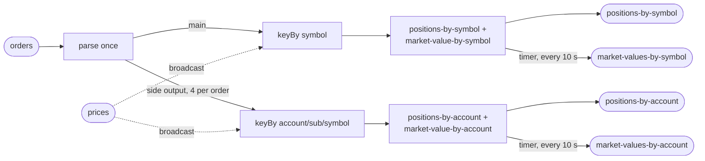

# Plan

**No one approved this plan.** It is a clean-room run with nobody to ask
(SKILL section 1a). It is written before any code and before any number exists,
so a reader can see what the run committed to. Interview answers:
`ANSWERS.md`. Everything the answers left open: `ASSUMPTIONS.md`.

## The test

| | |
|---|---|
| the objective | near-linear scaling across 1, 2 and 4 cores. Each step must return **1.80x or better** on a doubling, judged on the low end of its range. Two steps are reported, 1->2 and 2->4; 2->4 leads |
| where it runs | this laptop (Apple Silicon, 8 CPUs, 16 GB, Docker VM 9,937 MiB), in Docker |
| the stack | `flink:1.20.1-scala_2.12-java17` and **Confluent** Kafka `confluentinc/cp-kafka:7.7.0` (question 6), one broker, KRaft, capped at 2.5 cores and 5,376m |
| what is measured | the drain rate of a fixed backlog of orders at each core count, read from committed broker offsets, with the resource columns beside it. Second reading: rows in the two position topics divided by 5 |
| what is proved first | completeness with no tolerances, on a clean drain and again after killing the pipeline mid-run (the harness kills the task manager at about 40%); no throughput table is published for a build that has not passed |
| what is built | the pipeline (DataStream API), a deterministic generator (orders and prices), a verifier, and the dashboard (Prometheus, Grafana, the shipped CPU exporter) |
| the shape of the suite | 3 passes per case at 1, 2 and 4 cores, ascending then descending then ascending, then the 1-core baseline once more as a drift check: **10 measured cases** |
| the guarantee | exactly-once checkpointing every 10,000 ms; an at-least-once Kafka sink made idempotent by emitting the absolute position per key |
| how long it takes | about **3 hours** for the chain once the code builds (clean-room runs have taken two to three), plus about an hour to build and debug the pipeline first |
| what it writes | suite backlog 300,000,000 order records; tiny proof 160,000,000; completeness 20,000,000 (twice over one topic); prices 16,384 records. At about 230 bytes of JSON each, compressed with lz4 on the way in, that is **tens of gigabytes of Kafka log** (a guess until the tiny proof measures bytes per record). Output topics carry 5 rows per order, with retention set. Host free disk is 134 GB and the harness checks it before every case |
| what it occupies | ports 19092 (Kafka), 18081 (Flink REST), 13000 (Grafana), 19090 (Prometheus), 19110 (CPU exporter); 8 partitions; every container, volume and network prefixed `st49c` |
| where to watch it | **`results/PROGRESS.txt`** — one sentence, overwritten: which step of seven, which case of ten, roughly how long is left. This agent runs detached and cannot speak to anyone until it finishes, so that file is the place to watch; whoever started the run relays it |

## The pipeline

- `topics.in` = `orders`; `topics.out` = `positions-by-symbol`, `positions-by-account`; `outputsPerInput` = 5.
- `topicsAlsoWritten` = `market-values-by-symbol`, `market-values-by-account`.
- `prices` is created and filled by the generator; the harness does not touch it.
- `keySets`: symbol (4,096) and account / sub-account / symbol (16,384).

## Order of work

1. Write the job, generator and verifier in one Maven module; build with Java 17.
2. Write `pipeline.json` from the field table in `harness/README.md`, with the
   dashboard in `extraServices` and every `flinkProperties` entry present before
   the first `up`.
3. Prove pieces at the cheapest level first: generator determinism and the
   verifier locally, then `prove.py up`, `preflight` and `completeness` by hand
   until they pass.
4. Then `prove.py all`, detached, and wait on `results/DONE`.
5. If a step misses 1.80x: `prove.py probe --repeats 9`, then `prove.py ceiling`,
   then at most four changes from SKILL 6a, one at a time, each predicted in
   `FIXES.md` before it is measured, reverted if it makes the step worse.
6. Leave the stack up.
