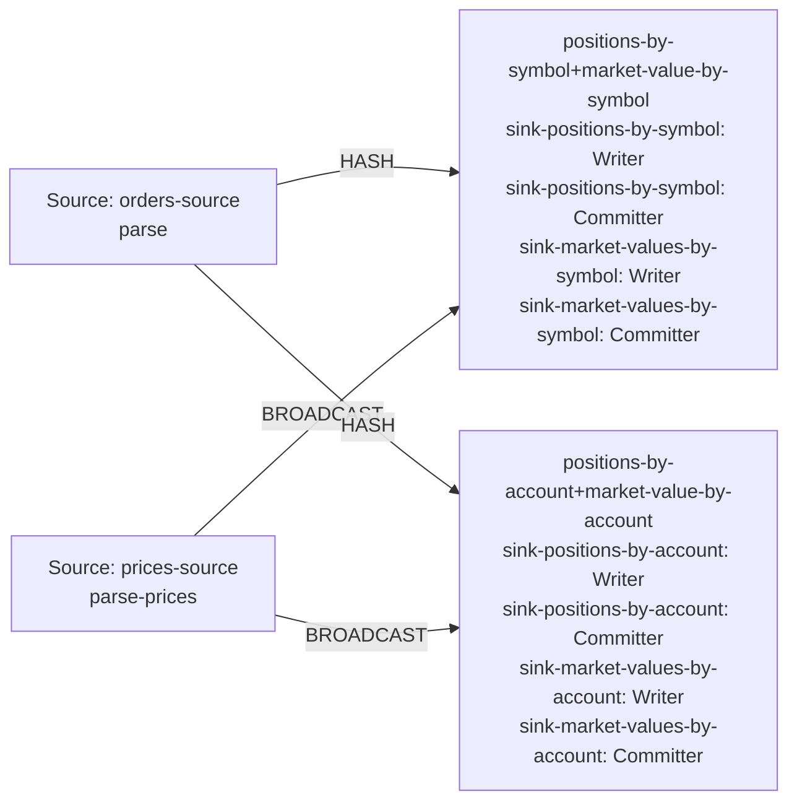

| field | value |
|---|---|
| axis | one machine, more cores: one task manager container capped at N cores, parallelism N, N slots |
| API level | Flink DataStream API, hand-written operators (no SQL, no Table API) |
| guarantee | state: exactly-once checkpointing every 10 s; sink: at-least-once, idempotent by emitting the absolute position per key |
| checkpoint interval | 10000 ms |
| build hash | `0b585bd3f4abe677` (completeness passed for `0b585bd3f4abe677`) |
| passes per case | 3 |
| study | scaling: every case configured identically |
| workload | 300,000,000 records, partitions 8, symbolKeys 4,096, accountKeys 16,384, predictedSymbolKeys 4,096, predictedAccountKeys 16,384, priceRecords 16,384, 5 outputs per input |
| rate source | committed broker offsets on `orders` |
| CPU source | cgroup `cpu.stat usage_usec` |
| suite span | 2026-09-24 14:24:59 -> 2026-09-24 15:04:01 EDT (39m)  dashboard: from=1790274299599&to=1790276641124 |

**1→2 cores: 1.94× (target 1.80×), range 1.87–2.02× across passes.**
**2→4 cores: 1.93× (target 1.80×), range 1.82–2.05× across passes.**

| cores | speed | scaling | pipeline CPU | pipeline memory | Kafka CPU | Kafka memory | blocked by | what to do |
|---:|---:|---:|---|---|---|---|---|---|
| | | what the step into it gave | cores it could use / how much it used | memory it could use / share of the time spent tidying memory up | cores Kafka could use / how much it used | memory Kafka could use / how many times it filled up | | |
| 1 | 131,538/s | — | 1 / 100% | 1536m / 3.7% | 2.5 / 4% | 5.25g, full 1,138x | Pipeline CPU | check it matches |
| 2 | 255,648/s | 1.94x | 2 / 100% | 2048m / 1.6% | 2.5 / 8% | 5.25g, never full | Pipeline CPU | add cores for more |
| 4 | 493,284/s | 1.93x | 4 / 100% | 3072m / 1.0% | 2.5 / 17% | 5.25g, never full | Pipeline CPU | add cores for more |

| cores | pass | records/s | tm cores | % of cap | throttled | broker cores | src idle | src BP | headroom | vantage |
|---:|---|---:|---:|---:|---:|---:|---:|---:|---:|---:|
| 1 | p1-asc | 131,103 | 0.95 | 95.4% | 100% | 0.11 / 2.5 | 0.0% | 47.4% | 2147 s | 0.35% |
| 2 | p1-asc | 264,492 | 2.00 | 99.9% | 100% | 0.21 / 2.5 | 0.8% | 43.2% | 990 s | 0.19% |
| 4 | p1-asc | 506,832 | 3.99 | 99.8% | 100% | 0.43 / 2.5 | 1.5% | 26.7% | 434 s | 0.46% |
| 4 | p2-desc | 480,246 | 3.99 | 99.7% | 99% | 0.46 / 2.5 | 1.7% | 26.5% | 473 s | 0.21% |
| 2 | p2-desc | 247,008 | 1.99 | 99.7% | 99% | 0.22 / 2.5 | 0.4% | 48.4% | 1059 s | 0.53% |
| 1 | p2-desc | 132,065 | 0.99 | 99.4% | 100% | 0.10 / 2.5 | 0.0% | 47.7% | 2132 s | 0.23% |
| 1 | p3-asc | 130,788 | 1.00 | 99.9% | 100% | 0.11 / 2.5 | 0.1% | 45.8% | 2140 s | 0.31% |
| 2 | p3-asc | 255,446 | 2.00 | 100.0% | 100% | 0.20 / 2.5 | 0.7% | 44.8% | 1020 s | 0.47% |
| 4 | p3-asc | 492,775 | 4.01 | 100.3% | 100% | 0.43 / 2.5 | 1.4% | 26.6% | 462 s | 0.13% |
| 1 | sentinel | 132,198 | 1.00 | 99.8% | 100% | 0.11 / 2.5 | 0.1% | 46.4% | 2127 s | 0.46% |

| cores | passes | mean records/s | spread | reportable |
|---:|---:|---:|---:|---|
| 1 | 4 | 131,538 | 1.1% | yes |
| 2 | 3 | 255,648 | 6.8% | yes |
| 4 | 3 | 493,284 | 5.4% | yes |

Sentinel: the 1-core case first (131,103 rec/s) and last (132,198 rec/s), drift +0.8% across the suite; counted in that case's spread.

### The job graph that ran

Read off the running plan, not drawn. Every case ran this shape — a row whose shape differed would have been thrown out.

