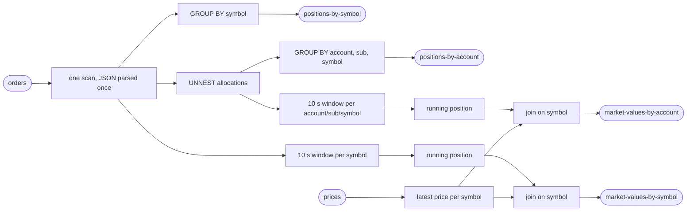

# Plan — run 50 (project token `st50`)

**Nobody approved this plan.** It is a clean-room run with no human to ask
(§1a of the skill). It is written before any code or any number, so a reader
can see what the run committed to. The six answers are in `ANSWERS.md`;
everything they did not settle is in `ASSUMPTIONS.md`.

## The test

| | |
|---|---|
| the objective | **near-linear scaling across 1, 2 and 4 cores.** Each step must return **1.80× or better** on a doubling, judged on the low end of its range. Two steps are reported, 1→2 and 2→4. The question this run exists to answer: does a **SQL** build of the default business case scale as well as the DataStream builds? |
| where it runs | this laptop, in Docker Desktop (8 CPUs, 9,937 MiB VM) |
| the stack | `flink:1.20.1-scala_2.12-java17`, `apache/kafka:3.9.0` (question 6: Apache), plus Prometheus, Grafana and the skill's Docker CPU exporter for the dashboard |
| what is measured | the drain rate of a fixed backlog of orders at 1, 2 and 4 cores, read from the committed offsets on `orders`, with the pipeline's CPU, the broker's CPU and memory, GC and back-pressure beside it. Second reading: output rows ÷ 5 |
| what is proved first | completeness with no tolerances on a 4,000,000-order test set, once cleanly and once with the pipeline **killed** mid-run and restarted (kill at 40%); then the design diff (every declared operator and output present). No throughput table is published for a build that has not passed |
| what is built | a Flink **SQL** job (a Java `main` that runs DDL and one `STATEMENT SET` of four `INSERT INTO`s), a deterministic generator (orders + prices), a verifier, a dashboard, and `pipeline.json` |
| the shape of the suite | cases 1, 2, 4 cores; **3 passes** per case, ascending then descending then ascending, then the 1-core baseline once more as the sentinel: **10 measured cases** |
| the guarantee | **exactly-once checkpointing every 10 s**; an **at-least-once upsert sink** made idempotent by writing the absolute position (and the per-key order count) per key |
| how long it takes | **about 2 to 3 hours** end to end: stack and preflight ~5 min, completeness ~10 min, tiny proof ~20 min, fill ~15 min, suite ~60–80 min, report seconds. If the tiny proof re-sizes the backlog, add an hour |
| what it writes | three backlogs of order records: suite 120,000,000, tiny proof 60,000,000, completeness 4,000,000 — roughly 20–40 GB of Kafka log, plus up to 2 GiB per output topic per case. Host free disk is 130 GB before starting |
| what it occupies | ports 19092 (Kafka), 18081 (Flink REST), 19090 (Prometheus), 13000 (Grafana), 19110 (CPU exporter); 8 partitions per topic; containers, volumes and network all prefixed `st50` |
| where to watch it | `results/PROGRESS.txt` — one sentence, overwritten by the harness: which step of seven, which case of ten, and roughly how long is left. I cannot message anyone while it runs (I am a detached agent), so that file is the place to look; whoever started me relays it |

## The pipeline

- Harness-owned: `orders` (in), `positions-by-symbol`, `positions-by-account` (out, 1 + 4 = 5 rows per order).
- Pipeline-owned: `prices` (in), `market-values-by-symbol`, `market-values-by-account` (throttled, declared in `topicsAlsoWritten`).
- API claim, said next to the numbers: *Flink SQL; the optimizer plans the graph. No hand-written operators.*

## Order of work

1. Build the jar (job, generator, verifier in one shaded jar). Check the SQL plan offline with `EXPLAIN` before any stack exists: one source scan, the four aggregations, two joins, what changelog each sink receives.
2. Write `pipeline.json` from the harness README's field table (not copied from the example), with the dashboard in `extraServices` and the Prometheus reporter in `flinkProperties` before the first `up`.
3. Prove the pieces at the cheapest level: generator determinism and a small fill; `prove.py completeness` on its own before the chain.
4. `prove.py all`, detached, waiting on `results/DONE` through a scratch-directory script.
5. If a step misses 1.80×: `prove.py probe --repeats 9`, then `prove.py ceiling`, then §6a levers one at a time, each with a prediction written in `FIXES.md` before it is measured, reverted if it makes the step worse, at most four.
6. Leave the stack up at the end.
