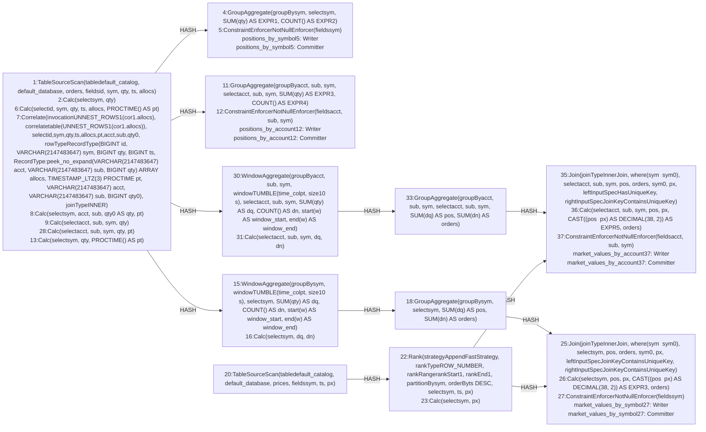

| field | value |
|---|---|
| axis | one machine, more cores: one task manager container capped at N cores, parallelism N, N slots |
| API level | Flink SQL: DDL plus one STATEMENT SET of four INSERT INTO statements, submitted from a Java main; the planner chooses every operator, exchange and chain (no DataStream code) |
| guarantee | state: exactly-once checkpointing; sink: at-least-once upsert-kafka, idempotent by writing the absolute position and order count per key |
| checkpoint interval | 10000 ms |
| build hash | `cf0586cba9111def` (completeness passed for `cf0586cba9111def`) |
| passes per case | 3 |
| study | scaling: every case configured identically |
| workload | 120,000,000 records, partitions 8, symbols 4,096, accountKeys 16,384, allocationsPerOrder 4, priceTicksPerSymbol 3, 5 outputs per input |
| rate source | committed broker offsets on `orders` |
| CPU source | cgroup `cpu.stat usage_usec` |
| suite span | 2026-09-25 00:03:30 -> 2026-09-25 00:46:48 EDT (43m)  dashboard: from=1790309010708&to=1790311608340 |

**2→4 cores: 1.82× (target 1.80×), range 1.73–1.94× across passes.**

| cores | speed | scaling | pipeline CPU | pipeline memory | Kafka CPU | Kafka memory | blocked by | what to do |
|---:|---:|---:|---|---|---|---|---|---|
| | | what the step into it gave | cores it could use / how much it used | memory it could use / share of the time spent tidying memory up | cores Kafka could use / how much it used | memory Kafka could use / how many times it filled up | | |
| 2 | 57,925/s | — | 2 / 100% | 2880m / 2.5% | 2.5 / 4% | 4.5g, never full | Pipeline CPU | check it matches |
| 4 | 105,570/s | 1.82x | 4 / 96% | 3968m / 0.8% | 2.5 / 7% | 4.5g, never full | Pipeline CPU | check the host |

| cores | pass | records/s | tm cores | % of cap | throttled | broker cores | src idle | src BP | headroom | vantage |
|---:|---|---:|---:|---:|---:|---:|---:|---:|---:|---:|
| 1 | p1-asc **(ceiling)** | 28,906 | 1.00 | 100.3% | 100% | 0.04 / 2.5 | 0.0% | 2.9% | 4013 s | 0.35% |
| 2 | p1-asc | 59,178 | 2.00 | 100.1% | 100% | 0.09 / 2.5 | 0.0% | 3.0% | 1885 s | 0.37% |
| 4 | p1-asc | 108,809 | 3.94 | 98.6% | 100% | 0.17 / 2.5 | 0.0% | 2.3% | 955 s | 0.38% |
| 4 | p2-desc | 105,667 | 4.01 | 100.2% | 100% | 0.18 / 2.5 | 0.0% | 2.2% | 979 s | 0.29% |
| 2 | p2-desc | 56,066 | 1.96 | 98.1% | 100% | 0.09 / 2.5 | 0.0% | 3.1% | 2006 s | 0.30% |
| 1 | p2-desc **(ceiling)** | 27,676 | 1.00 | 100.2% | 100% | 0.04 / 2.5 | 0.0% | 3.3% | 4198 s | 0.03% |
| 1 | p3-asc **(ceiling)** | 27,455 | 1.00 | 99.7% | 100% | 0.04 / 2.5 | 0.0% | 2.5% | 4239 s | 0.28% |
| 2 | p3-asc | 58,529 | 1.99 | 99.6% | 100% | 0.09 / 2.5 | 0.0% | 2.9% | 1902 s | 0.25% |
| 4 | p3-asc | 102,234 | 3.83 | 95.8% | 100% | 0.17 / 2.5 | 0.0% | 2.2% | 1027 s | 0.24% |
| 1 | sentinel **(ceiling)** | 27,773 | 0.99 | 99.4% | 100% | 0.04 / 2.5 | 0.0% | 3.3% | 4193 s | 0.37% |

| cores | passes | mean records/s | spread | reportable |
|---:|---:|---:|---:|---|
| 2 | 3 | 57,925 | 5.4% | yes |
| 4 | 3 | 105,570 | 6.2% | yes |

### The job graph that ran

Read off the running plan, not drawn. Every case ran this shape — a row whose shape differed would have been thrown out.

