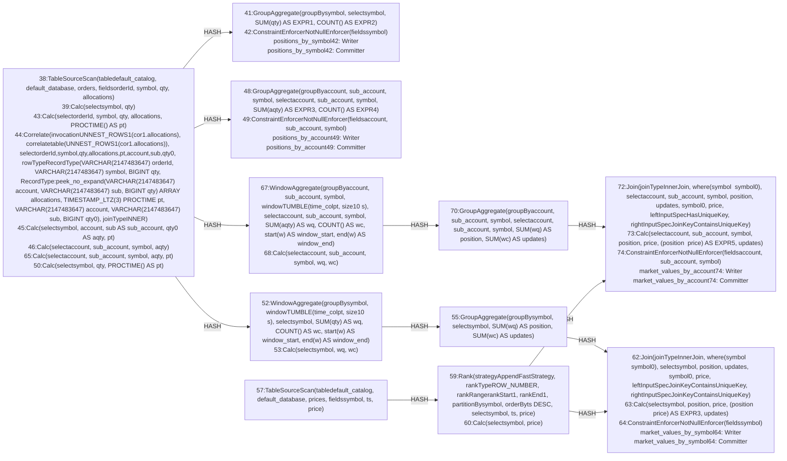

| field | value |
|---|---|
| axis | one machine, more cores: one task manager container capped at N cores, parallelism N, N slots |
| API level | Flink SQL (Table API StatementSet of four INSERTs, planner-generated operators; no DataStream code) |
| guarantee | state: exactly-once checkpointing; sink: at-least-once upsert-kafka, idempotent by emitting the absolute position per key |
| checkpoint interval | 10000 ms |
| build hash | `fa1f233378a9cfaa` (completeness passed for `fa1f233378a9cfaa`) |
| passes per case | 3 |
| study | scaling: every case configured identically |
| workload | 60,000,000 records, distinctSymbols 4,096, distinctAccountKeys 16,384, allocationsPerOrder 4, priceTicksPerSymbol 3, 5 outputs per input |
| rate source | committed broker offsets on `orders` |
| CPU source | cgroup `cpu.stat usage_usec` |
| suite span | 2026-09-25 09:39:02 -> 2026-09-25 10:23:19 EDT (44m)  dashboard: from=1790343542856&to=1790346199809 |

**2→4 cores: 2.12× (target 1.80×), range 2.07–2.19× across passes.**

| cores | speed | scaling | pipeline CPU | pipeline memory | Kafka CPU | Kafka memory | blocked by | what to do |
|---:|---:|---:|---|---|---|---|---|---|
| | | what the step into it gave | cores it could use / how much it used | memory it could use / share of the time spent tidying memory up | cores Kafka could use / how much it used | memory Kafka could use / how many times it filled up | | |
| 2 | 45,778/s | — | 2 / 100% | 2368m / 2.5% | 2.5 / 16% | 4.5g, never full | Pipeline CPU | no usable step |
| 4 | 97,108/s | 2.12x | 4 / 98% | 3648m / 0.8% | 2.5 / 31% | 4.5g, never full | Pipeline CPU | baseline reads low |

| cores | pass | records/s | tm cores | % of cap | throttled | broker cores | src idle | src BP | headroom | vantage |
|---:|---|---:|---:|---:|---:|---:|---:|---:|---:|---:|
| 1 | p1-asc **(ceiling)** | 19,932 | 1.00 | 100.3% | 100% | 0.30 / 2.5 | 0.0% | 2.4% | 2885 s | 0.22% |
| 2 | p1-asc | 45,439 | 2.00 | 100.2% | 100% | 0.40 / 2.5 | 0.0% | 2.2% | 1173 s | 0.39% |
| 4 | p1-asc | 99,319 | 3.98 | 99.6% | 100% | 0.67 / 2.5 | 0.0% | 2.6% | 460 s | 0.52% |
| 4 | p2-desc | 95,083 | 4.00 | 99.9% | 100% | 0.71 / 2.5 | 0.0% | 3.1% | 475 s | 0.05% |
| 2 | p2-desc | 45,992 | 2.00 | 100.0% | 100% | 0.40 / 2.5 | 0.0% | 2.7% | 1154 s | 0.21% |
| 1 | p2-desc **(ceiling)** | 20,440 | 1.00 | 100.1% | 100% | 0.29 / 2.5 | 0.0% | 3.2% | 2816 s | 0.10% |
| 1 | p3-asc **(ceiling)** | 20,034 | 0.99 | 99.4% | 100% | 0.29 / 2.5 | 0.0% | 2.5% | 2871 s | 0.04% |
| 2 | p3-asc | 45,902 | 2.00 | 99.9% | 100% | 0.40 / 2.5 | 0.0% | 2.3% | 1136 s | 0.30% |
| 4 | p3-asc | 96,923 | 3.91 | 97.9% | 100% | 0.76 / 2.5 | 0.0% | 2.9% | 473 s | 0.37% |
| 1 | sentinel **(ceiling)** | 20,659 | 1.00 | 100.1% | 100% | 0.29 / 2.5 | 0.0% | 3.0% | 2780 s | 0.19% |

| cores | passes | mean records/s | spread | reportable |
|---:|---:|---:|---:|---|
| 2 | 3 | 45,778 | 1.2% | yes |
| 4 | 3 | 97,108 | 4.4% | yes |

### The job graph that ran

Read off the running plan, not drawn. Every case ran this shape — a row whose shape differed would have been thrown out.

