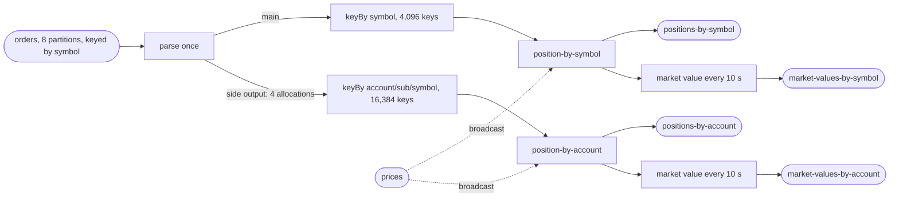

# Plan

**No one approved this plan.** This is clean-room run 52: there is no human to
ask, so SKILL.md §1a says to write the plan anyway and build against it. It was
written before any code and before any number existed. The interview answers
are in `ANSWERS.md` (the defaults, verbatim) and everything I decided myself is
in `ASSUMPTIONS.md`.

## The test

| | |
|---|---|
| the objective | near-linear scaling across 1, 2 and 4 cores. Each step must return **1.80× or better** on a doubling, judged on the low end of the step's range. Two steps are reported, 1→2 and 2→4; 2→4 leads |
| where it runs | this laptop, in Docker Desktop (Apple Silicon, 8 CPUs, 9,937 MiB VM) |
| the stack | `flink:1.20.1-scala_2.12-java17` and `apache/kafka:3.9.0`, plus Prometheus, Grafana and the shipped per-container CPU exporter for the dashboard |
| what is measured | the drain rate of a fixed backlog of orders at 1, 2 and 4 cores, read from committed broker offsets, with CPU, memory, garbage collection and back-pressure beside it. A second reading comes from the position topics: their rows ÷ 5 |
| what is proved first | completeness with no tolerances on a 10,000,000-order test set, then again with the pipeline **killed mid-run** and restarted. No throughput table is published for a build that has not passed both |
| what is built | the Flink job, a deterministic generator (orders + prices), a verifier, and the dashboard |
| the shape of the suite | 3 passes per case, ascending then descending then ascending (1,2,4 / 4,2,1 / 1,2,4), then the 1-core baseline once more as a drift check: **10 measured cases**. Up to 6 more if a step's range straddles 1.80× |
| the guarantee | **exactly-once checkpointing** every 10 s (10,000 ms), and an **at-least-once sink** made idempotent by publishing the absolute position per key |
| how long it takes | about **2½ to 3 hours** end to end, most of it the suite. Clean-room runs have taken two to three hours |
| what it writes | three order backlogs: **200,000,000 records** for the suite, **100,000,000** for the tiny proof, **10,000,000** for completeness, plus a few thousand price records. Compressed with lz4 that is roughly 10–20 GB of Kafka log, and the output topics can hold up to about 32 GB between retention sweeps. Host free disk was 128 GB at the start; the harness checks it before every case |
| what it occupies | ports **19092** (Kafka), **18081** (Flink REST), **13000** (Grafana), **19090** (Prometheus). Containers, volumes and the network are all prefixed `st52`. 8 partitions on every topic |
| where to watch it | `results/PROGRESS.txt` — one sentence, overwritten: which step of seven, which case of ten, and roughly how long is left. I run detached and cannot message anyone mid-run, so that file is the place to look; `results/DONE` appears at the end |

## The pipeline

- One Kafka source for orders, parsed once; the symbol stream is the main
  output and the four allocations go out a side output. Neither path re-reads
  the topic (§6a, "read the input once").
- Each aggregation is a keyed broadcast process function: it applies an order
  to the running position (dropping a repeated order id), publishes the
  absolute position immediately, and on a 10 s processing-time tick publishes
  position × latest price to its market-value topic if anything changed.
- Prices are a second Kafka source, broadcast to both aggregations.
- All six operators named so the design diff can find them: `parse-orders`,
  `position-by-symbol`, `position-by-account`, `sink-positions-by-symbol`,
  `sink-positions-by-account`, `sink-market-values-by-symbol`,
  `sink-market-values-by-account`.

## Harness configuration

- `topics.in` = `orders`; `topics.out` = the two position topics;
  `outputsPerInput` = 5; `topicsAlsoWritten` = the two market-value topics;
  `design.every` = 10 s for both.
- `cases` [1, 2, 4], `baseline` 1, `passes` 3, `checkpointMs` 10000.
- Worker memory 1024m + 512m per core; broker 4,352m with a 1G heap; Kafka 2.5
  cores; job manager 0.5.
- G1 pinned; Prometheus reporter on port 9249 via `flinkProperties`.
- `keySets` names the manifest fields listing all 4,096 symbol and 16,384
  account keys; if preflight names a `pipeline.max-parallelism`, it goes into
  `flinkProperties` **before the first `up`**.

## Order of work

1. Write the job, generator, verifier; build the jar; smoke-test the generator
   and verifier on the host.
2. Write the dashboard (four rows, §7) and `pipeline.json` with the dashboard
   in `extraServices` from the start.
3. `prove.py replay`, then launch `prove.py all` detached; wait on
   `results/DONE` with `watch.sh` from a script that does not name this
   directory on its command line.
4. If the chain stops on something I built, fix it, record it, and re-launch.
   If a step misses 1.80×, follow §6: probe, ceiling, then one §6a lever at a
   time, each written in `FIXES.md` with a prediction first, at most four.
5. Leave the stack up.
