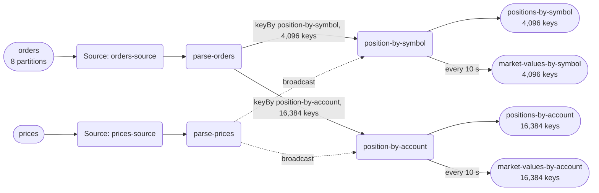

| field | value |
|---|---|
| axis | one machine, more cores: one task manager container capped at N cores, parallelism N, N slots |
| API level | Flink DataStream API, hand-written operators |
| guarantee | state: exactly-once checkpointing; sink: at-least-once, idempotent by publishing the absolute position per key |
| checkpoint interval | 10000 ms |
| build hash | `47546d835381037c` (completeness passed for `47546d835381037c`) |
| passes per case | 3 |
| study | scaling: every case configured identically |
| workload | 200,000,000 records, uniqueOrders 199,000,000, duplicateRecords 1,000,000, symbolCount 4,096, accountKeyCount 16,384, outputsPerOrder 5, totalAbsQuantity 99,598,943,957, 4.975 outputs per input |
| rate source | committed broker offsets on `orders` |
| CPU source | cgroup `cpu.stat usage_usec` |
| suite span | 2026-09-30 22:13:53 -> 2026-09-30 23:17:54 EDT (1h 04m)  dashboard: from=1790820833992&to=1790824674101 |

**1→2 cores: 1.97× (target 1.80×), range 1.85–2.12× across passes.**
**2→4 cores: 1.86× (target 1.80×), range 1.70–1.98× across passes.**

| cores | speed | scaling | pipeline CPU | pipeline memory | Kafka CPU | Kafka memory | blocked by | what to do |
|---:|---:|---:|---|---|---|---|---|---|
| | | what the step into it gave | cores it could use / how much it used | memory it could use / share of the time spent tidying memory up | cores Kafka could use / how much it used | memory Kafka could use / how many times it filled up | | |
| 1 | 128,202/s | — | 1 / 100% | 1536m / 2.5% | 2.5 / 5% | 4.25g, full 3,240x | Pipeline CPU | check it matches |
| 2 | 251,986/s | 1.97x | 2 / 99% | 2048m / 1.0% | 2.5 / 10% | 4.25g, full 5,617x | Pipeline CPU | add cores for more |
| 4 | 468,178/s | 1.86x | 4 / 100% | 3072m / 0.6% | 2.5 / 19% | 4.25g, never full | Pipeline CPU | more passes |

| cores | pass | records/s | tm cores | % of cap | throttled | broker cores | src idle | src BP | headroom | vantage |
|---:|---|---:|---:|---:|---:|---:|---:|---:|---:|---:|
| 1 | p1-asc | 123,295 | 1.00 | 99.8% | 100% | 0.17 / 2.5 | 0.1% | 33.4% | 1472 s | 0.27% |
| 2 | p1-asc | 255,668 | 2.00 | 100.2% | 100% | 0.26 / 2.5 | 0.6% | 32.0% | 640 s | 0.17% |
| 4 | p1-asc | 469,749 | 3.84 | 96.0% | 100% | 0.47 / 2.5 | 1.2% | 21.5% | 284 s | 0.26% |
| 4 | p2-desc | 481,350 | 4.01 | 100.3% | 99% | 0.52 / 2.5 | 1.4% | 20.5% | 273 s | 0.04% |
| 2 | p2-desc | 242,812 | 1.99 | 99.7% | 100% | 0.28 / 2.5 | 0.7% | 32.6% | 685 s | 0.18% |
| 1 | p2-desc | 127,018 | 1.00 | 100.3% | 100% | 0.14 / 2.5 | 0.0% | 33.8% | 1437 s | 0.43% |
| 1 | p3-asc | 131,101 | 1.00 | 100.2% | 100% | 0.13 / 2.5 | 0.0% | 35.3% | 1390 s | 0.29% |
| 2 | p3-asc | 253,828 | 2.00 | 99.9% | 100% | 0.25 / 2.5 | 0.7% | 28.1% | 652 s | 0.02% |
| 4 | p3-asc | 465,378 | 3.99 | 99.8% | 100% | 0.48 / 2.5 | 1.3% | 20.4% | 286 s | 0.28% |
| 1 | sentinel | 131,395 | 1.00 | 100.0% | 100% | 0.13 / 2.5 | 0.0% | 34.0% | 1378 s | 0.40% |
| 2 | settle-1 | 251,576 | 1.96 | 98.0% | 100% | 0.23 / 2.5 | 0.4% | 29.2% | 657 s | 0.22% |
| 4 | settle-2 | 444,118 | 3.97 | 99.2% | 100% | 0.54 / 2.5 | 1.7% | 19.5% | 263 s | 0.17% |
| 2 | settle-3 | 261,753 | 2.00 | 100.0% | 100% | 0.23 / 2.5 | 0.6% | 33.0% | 617 s | 0.21% |
| 4 | settle-4 | 478,042 | 4.00 | 100.0% | 100% | 0.49 / 2.5 | 1.3% | 21.2% | 274 s | 0.27% |
| 2 | settle-5 | 246,280 | 1.99 | 99.2% | 100% | 0.26 / 2.5 | 0.9% | 32.3% | 674 s | 0.27% |
| 4 | settle-6 | 470,429 | 3.98 | 99.6% | 100% | 0.48 / 2.5 | 1.6% | 19.6% | 278 s | 0.26% |

| cores | passes | mean records/s | spread | reportable |
|---:|---:|---:|---:|---|
| 1 | 4 | 128,202 | 6.3% | yes |
| 2 | 6 | 251,986 | 7.5% | yes |
| 4 | 6 | 468,178 | 8.0% | yes |

Sentinel: the 1-core case first (123,295 rec/s) and last (131,395 rec/s), drift +6.4% across the suite; counted in that case's spread.

### The job graph that ran

Read off the running plan, not drawn. Every case ran this shape — a row whose shape differed would have been thrown out. Partition and key counts come from the configuration and the run's own manifest; an interval on an output is what the build declared in design.every, not something the harness measured.

